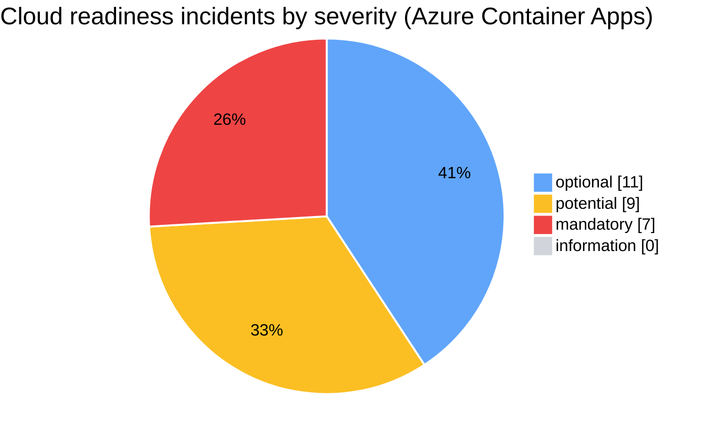
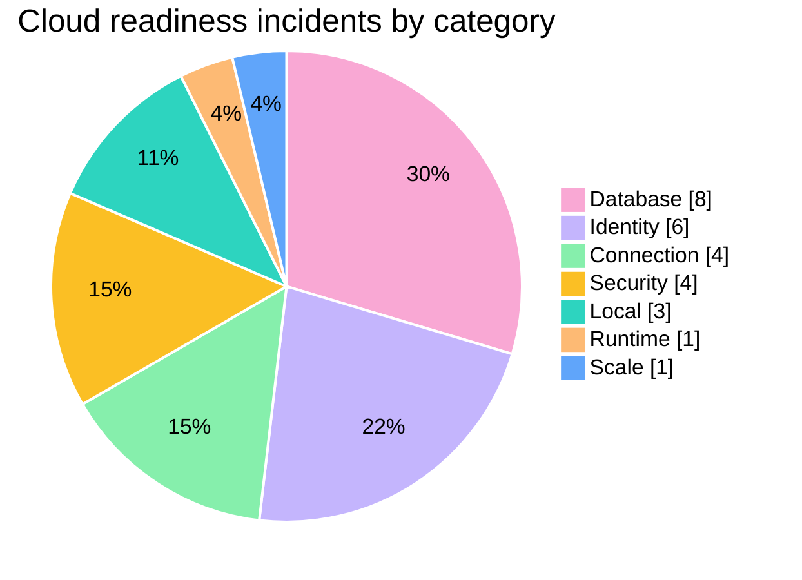
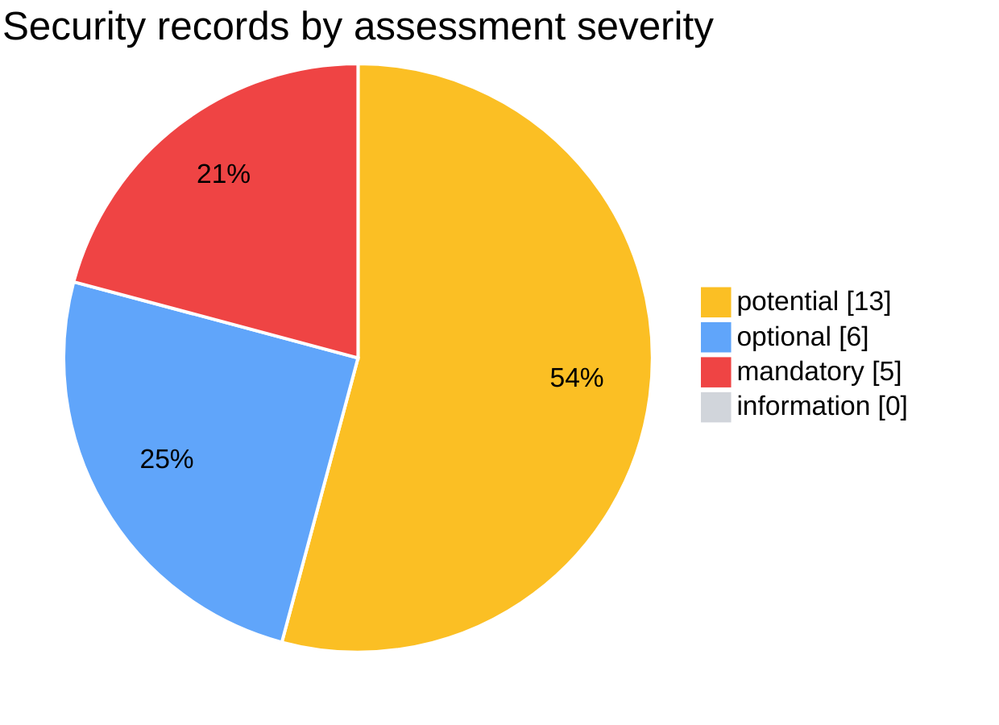
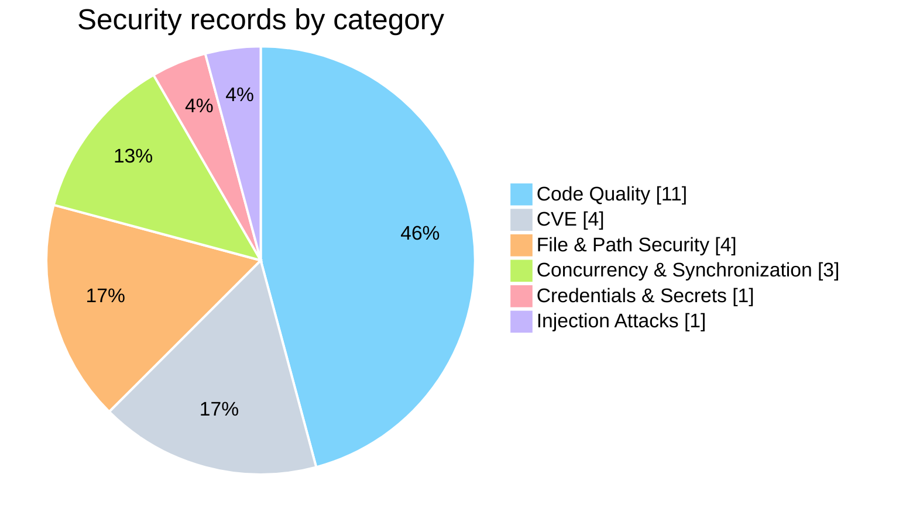
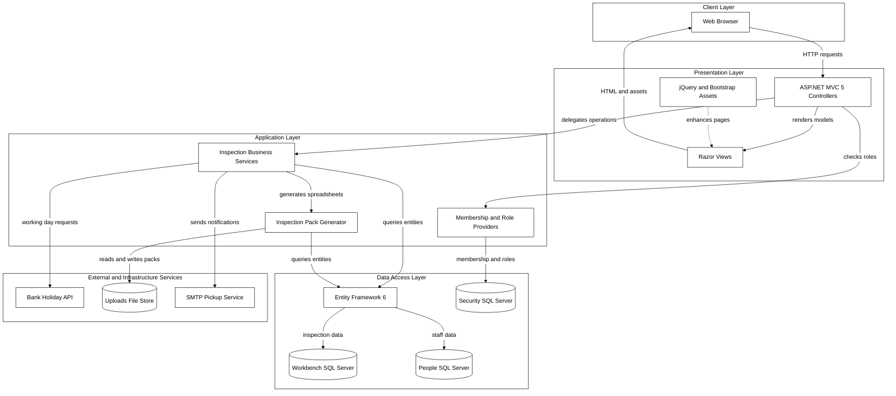
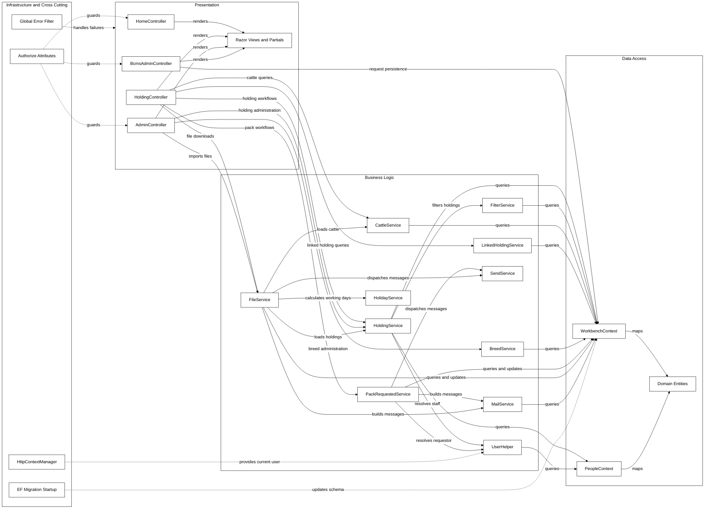
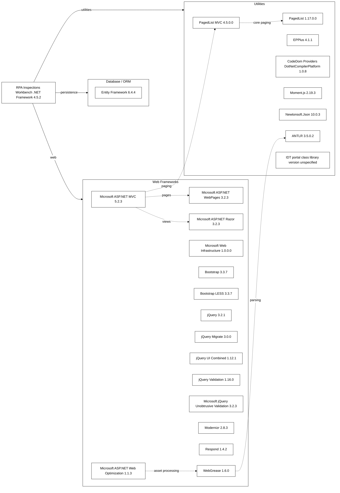
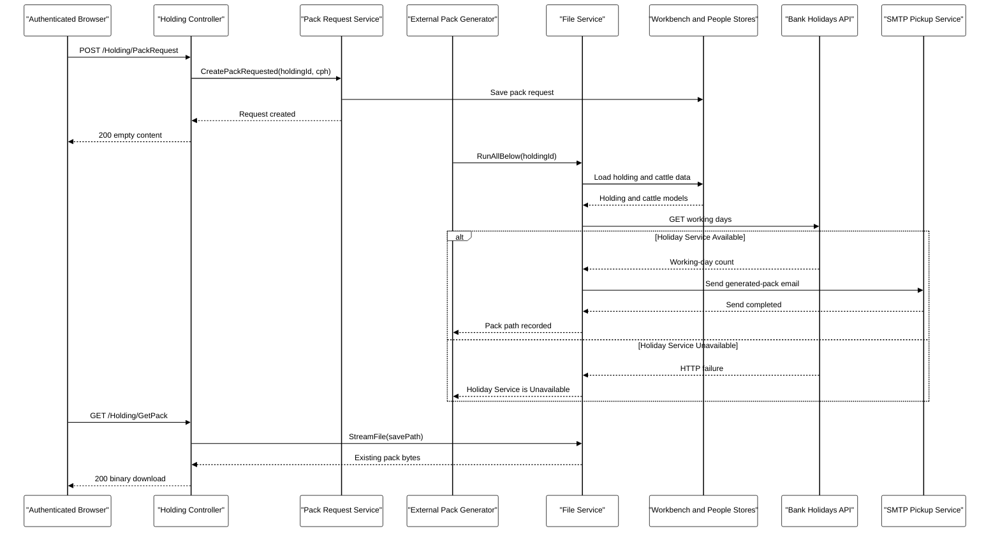
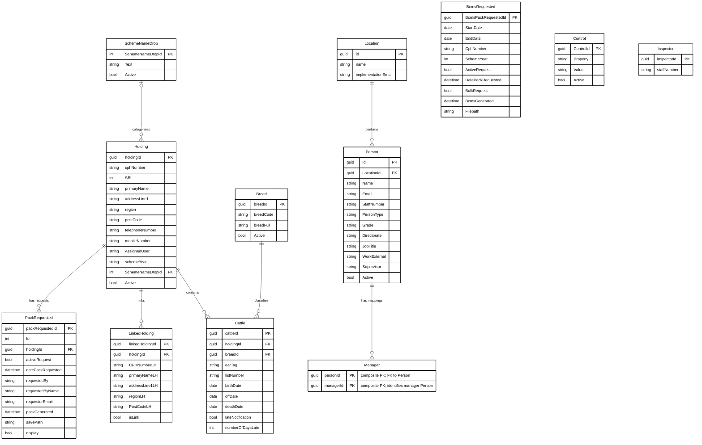
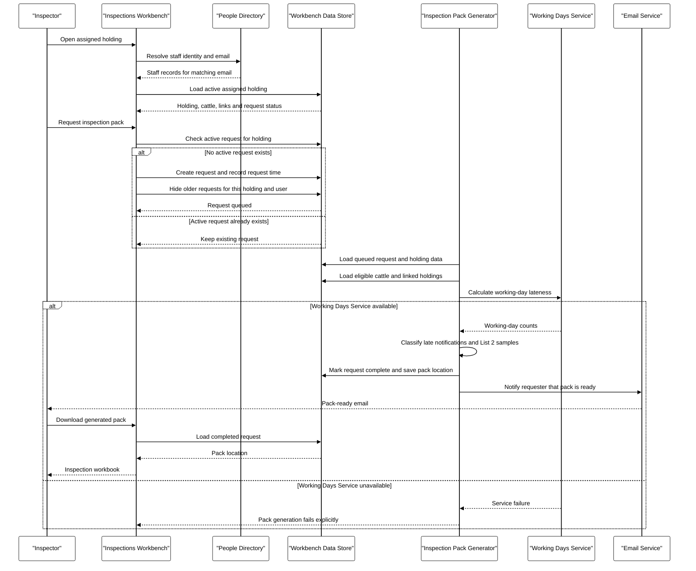

# Report_20261006101749 and Report_20261006105014 — Merged Cloud Readiness and Security Assessment

This report merges two historical App Modernisation assessments of **RPA.Inspections.Workbench** produced by the .NET AppCAT CLI: the cloud-readiness assessment [`Report_20261006101749`](../.github/modernize/assessment/reports/report-20261006101749/) (analysed 2026-10-06 08:17:49.031 UTC to 2026-10-06 08:48:04.978 UTC) and the security assessment [`Report_20261006105014`](../.github/modernize/assessment/reports/report-20261006105014/) (analysed 2026-10-06 08:50:14.685 UTC to 2026-10-06 08:54:23.304 UTC). It is a Markdown export of those stored results, not a fresh scan; the original `report.json`, `solution.json`, and `facts/` artifacts remain unchanged in their source folders. Cloud-readiness findings, migration mappings, and supporting analysis come from `Report_20261006101749`; security records come from `Report_20261006105014`. Source discrepancies between the two runs are flagged in [Source Notes and Discrepancies](#source-notes-and-discrepancies) rather than silently reconciled.

## Contents

- [1. Assessment Metadata](#1-assessment-metadata)
- [2. Assessment Summary](#2-assessment-summary)
  - [Source Notes and Discrepancies](#source-notes-and-discrepancies)
- [3. Cloud Readiness Findings — Azure Container Apps](#3-cloud-readiness-findings--azure-container-apps)
- [4. Security Findings](#4-security-findings)
- [5. Migration Solution Mapping](#5-migration-solution-mapping)
- [6. Supporting Analysis and Original Diagrams](#6-supporting-analysis-and-original-diagrams)
  - [Architecture Diagram](#architecture-diagram)
  - [Dependency Map](#dependency-map)
  - [API & Service Communication Contracts](#api--service-communication-contracts)
  - [Data Architecture & Persistence Layer](#data-architecture--persistence-layer)
  - [Configuration & Externalized Settings Inventory](#configuration--externalized-settings-inventory)
  - [Core Business Workflows](#core-business-workflows)

## 1. Assessment Metadata

**Report_20261006101749** (cloud-readiness source)

- **Report:** Report_20261006101749 (ID `20261006101749`); format version 1.0.0, produced by .NET AppCAT CLI
- **Status / mode:** completed / full
- **Analysis window (UTC):** 2026-10-06 08:17:49.031 UTC to 2026-10-06 08:48:04.978 UTC
- **Privacy mode:** Protected ([help](https://aka.ms/appmod-privacy-mode))
- **Targets:** Azure Container Apps — IDs `ACA`
- **Domains:** cloud-readiness
- **CVE scanning:** minimum severity `high`, scan scope `direct`
- **Capabilities:** None specified; **operating systems:** None specified
- **Source folder:** `.github/modernize/assessment/reports/report-20261006101749/` (`report.json`, `solution.json`, `facts/` with 6 supporting documents)

**Report_20261006105014** (security source)

- **Report:** Report_20261006105014 (ID `20261006105014`); format version 1.0.0, produced by .NET AppCAT CLI
- **Status / mode:** completed / issue-only
- **Analysis window (UTC):** 2026-10-06 08:50:14.685 UTC to 2026-10-06 08:54:23.304 UTC
- **Privacy mode:** Protected ([help](https://aka.ms/appmod-privacy-mode))
- **Targets:** Azure App Service, Azure Kubernetes Service, Azure Container Apps, Azure App Service Container, Azure App Service Managed Instance — IDs `AppService.Windows`, `AppService.Linux`, `AKS.Windows`, `AKS.Linux`, `ACA`, `AppServiceContainer.Linux`, `AppServiceContainer.Windows`, `AppServiceManagedInstance.Windows`
- **Domains:** security, cloud-readiness
- **CVE scanning:** minimum severity `high`, scan scope `direct`
- **Capabilities:** None specified; **operating systems:** None specified
- **Source folder:** `.github/modernize/assessment/reports/report-20261006105014/` (`report.json`, `solution.json`; no `facts/` folder)

## 2. Assessment Summary

| Group | Metric | Value |
|---|---|---:|
| Cloud readiness — totals (`Report_20261006101749`) | Projects | 1 |
| Cloud readiness — totals (`Report_20261006101749`) | Distinct rules (issue types) | 8 |
| Cloud readiness — totals (`Report_20261006101749`) | Incidents | 27 |
| Cloud readiness — totals (`Report_20261006101749`) | Effort (story points) | 75 |
| Cloud readiness — incident severity, Azure Container Apps (`Report_20261006101749`) | mandatory | 7 |
| Cloud readiness — incident severity, Azure Container Apps (`Report_20261006101749`) | potential | 9 |
| Cloud readiness — incident severity, Azure Container Apps (`Report_20261006101749`) | optional | 11 |
| Cloud readiness — incident severity, Azure Container Apps (`Report_20261006101749`) | information | 0 |
| Cloud readiness — incident severity as summarised by `Report_20261006105014` | mandatory | 6 |
| Cloud readiness — incident severity as summarised by `Report_20261006105014` | potential | 9 |
| Cloud readiness — incident severity as summarised by `Report_20261006105014` | optional | 12 |
| Cloud readiness — incident severity as summarised by `Report_20261006105014` | information | 0 |
| Cloud readiness — incidents by category | Runtime | 1 |
| Cloud readiness — incidents by category | Scale | 1 |
| Cloud readiness — incidents by category | Connection | 4 |
| Cloud readiness — incidents by category | Database | 8 |
| Cloud readiness — incidents by category | Identity | 6 |
| Cloud readiness — incidents by category | Security | 4 |
| Cloud readiness — incidents by category | Local | 3 |
| Security — totals (`Report_20261006105014`) | Security records | 24 |
| Security — totals (`Report_20261006105014`) | CWE records | 20 |
| Security — totals (`Report_20261006105014`) | CVE records | 4 |
| Security — totals (`Report_20261006105014`) | Effort (story points) | 90 |
| Security — records by assessment severity | mandatory | 5 |
| Security — records by assessment severity | potential | 13 |
| Security — records by assessment severity | optional | 6 |
| Security — records by assessment severity | information | 0 |
| Security — records by category | Code Quality | 11 |
| Security — records by category | Concurrency & Synchronization | 3 |
| Security — records by category | Credentials & Secrets | 1 |
| Security — records by category | File & Path Security | 4 |
| Security — records by category | Injection Attacks | 1 |
| Security — records by category | CVE | 4 |

Cloud-readiness effort and security effort are both expressed in story points but are reported separately by the source and are not combined here. The cloud-readiness `Security` category (configuration findings from rule `Security.0002`) is distinct from the security-domain records in section 4.

### Cloud Readiness Severity — Azure Container Apps

Colour key: optional = blue (`#60A5FA`); potential = amber (`#FBBF24`); mandatory = red (`#EF4444`); information = grey (`#D1D5DB`).
Zero-count severities (information) are retained in the chart data and legend but have no visible slice.

### Cloud Readiness Categories

Colour key: Database = pink (`#F9A8D4`); Identity = violet (`#C4B5FD`); Connection = green (`#86EFAC`); Security = amber (`#FBBF24`); Local = teal (`#2DD4BF`); Runtime = orange (`#FDBA74`); Scale = blue (`#60A5FA`). Category colours distinguish groups only; they do not indicate severity.

### Security Severity

Colour key: potential = amber (`#FBBF24`); optional = blue (`#60A5FA`); mandatory = red (`#EF4444`); information = grey (`#D1D5DB`). These are the source assessment ratings; CVE advisory (CVSS) ratings are listed separately in section 4.
Zero-count severities (information) are retained in the chart data and legend but have no visible slice.

### Security Categories

Colour key: Code Quality = sky (`#7DD3FC`); CVE = slate (`#CBD5E1`); File & Path Security = orange (`#FDBA74`); Concurrency & Synchronization = lime (`#BEF264`); Credentials & Secrets = rose (`#FDA4AF`); Injection Attacks = violet (`#C4B5FD`). Category colours distinguish groups only; they do not indicate severity.

### Source Notes and Discrepancies

- **Duplicate cloud-readiness results.** `Report_20261006105014` (domains: security, cloud-readiness) re-reported the cloud-readiness incidents. Its 27 incidents are identical to the 27 in `Report_20261006101749` by rule, location, and snippet, and their per-target ratings are identical; only the internal incident IDs differ. Each incident is therefore shown once in section 3, using `Report_20261006101749` as the source.
- **Rule-level `severity` differs for `Runtime.0002`:** `mandatory` in `Report_20261006101749` versus `optional` in `Report_20261006105014`. The per-incident target ratings are the same in both runs; section 3 shows both rule-level values.
- **Summary severity counts differ between runs.** `Report_20261006101749` reports mandatory 7, potential 9, optional 11, information 0 (matching the per-incident ACA ratings); `Report_20261006105014` reports mandatory 6, potential 9, optional 12, information 0, which matches the per-incident ratings for `AppService.Windows`, `AppServiceManagedInstance.Windows` rather than all 8 selected targets. Totals (incidents, rules, effort, categories) are the same in both runs.
- **Target names.** `Report_20261006105014` lists 8 target IDs but 5 display names (operating-system variants share a display name); this report therefore labels per-target ratings by target ID.
- **Path separators.** Security evidence paths use a mix of `\` and `/` separators in the source; links normalise them to `/`.
- **Categorisation.** The source places `CWE-778` (Insufficient Logging) in the `Credentials & Secrets` category; this categorisation is preserved.
- **Rule text.** The source description for `Identity.0002` ends with a stray double quote; it is preserved as supplied.
- **Omitted internal identifiers.** Internal incident IDs (different in each run) and incident/rule labels (empty in both runs) are not reproduced; they remain in the source `report.json` files.
- **Supporting analysis** exists only for `Report_20261006101749`; `Report_20261006105014` ran in `issue-only` mode and has no `facts/` folder.

## 3. Cloud Readiness Findings — Azure Container Apps

Selected target for `Report_20261006101749`: **Azure Container Apps** (`ACA`). The source also records ratings for every other target ID on each incident; these are retained in the per-rule target-rating tables below.

### Project Overview

| Project | Application | Framework | Language | Build tool | Distinct rules | Incidents | Effort (story points) |
|---|---|---|---|---|---:|---:|---:|
| [RPA.Inspections.Workbench/RPA.Inspections.Workbench.csproj](../RPA.Inspections.Workbench/RPA.Inspections.Workbench.csproj) | RPA.Inspections.Workbench | .NETFramework,Version=v4.5.2 | C# | MSBuild | 8 | 27 | 75 |

### Findings Overview

| Rule | Title | Category | Rule severity (`20261006101749`) | Rule severity (`20261006105014`) | ACA incident severity | Incidents | Rule effort (story points) | ACA effort (story points) |
|---|---|---|---|---|---|---:|---:|---:|
| [Runtime.0002](#runtime0002--upgrade-to-newer-target-framework-to-get-better-cloud-experience) | Upgrade to newer target framework to get better cloud experience | Runtime | mandatory | optional | mandatory | 1 | 3 | 3 |
| [Scale.0001](#scale0001--static-content-detected) | Static content detected | Scale | optional | optional | optional | 1 | 3 | 3 |
| [Connection.0001](#connection0001--connection-string-is-detected) | Connection string is detected | Connection | potential | potential | potential | 4 | 3 | 12 |
| [Database.0002](#database0002--sql-database-connection-detected) | SQL database connection detected | Database | potential | potential | potential | 2 | 3 | 6 |
| [Database.0003](#database0003--systemdatasqlclient-dependency-detected) | System.Data.SqlClient dependency detected | Database | optional | optional | optional | 6 | 3 | 18 |
| [Identity.0002](#identity0002--windows-authentication-detected) | Windows authentication detected | Identity | mandatory | mandatory | mandatory | 6 | 3 | 18 |
| [Security.0002](#security0002--connection-strings-without-configuration-builders-detected) | Connection strings without configuration builders detected | Security | optional | optional | optional | 4 | 3 | 12 |
| [Local.0006](#local0006--hardcoded-urls-detected) | Hardcoded URLs detected | Local | potential | potential | potential | 3 | 1 | 3 |
| **Total** | | | | | | **27** | | **75** |

### Runtime.0002 — Upgrade to newer target framework to get better cloud experience

- **Category:** Runtime; **rule severity:** mandatory (`Report_20261006101749`), optional (`Report_20261006105014`); **rule effort:** 3 story points; **incidents:** 1
- **Migration solution:** `runtime-compatibility-prompt`

Upgrade to newer target framework to get better cloud experience.

If you are targeting Managed Instance on Azure App Service, validate on .NET Framework 4.8 or move to .NET 10. Persist any runtime prerequisites via install scripts; test in staging before production.

While if targeting other Azure compute services:

Application targeting .NET framework lower than 4.7.1 might missing features that would be needed for some cloud scenarios like scaling or getting secrets from secure external sources.

Azure App Service runs apps on .NET Framework 4.8 or .NET Framework 3.5. Apps running on on .NET Framework versions older than .NET Framework 4.8 could have potential compatibility issues. It is recommended to test your application running on .NET Framework 4.8. Note that it is not necessary to re-target to .NET Framework 4.8, only to validate that the app correctly runs on that version of .NET Framework.

In the long term it is also recommended to upgrade your application to latest supported .NET 8+ which would significantly increase performance of your application. Use tools like .NET Upgrade Assistant to help with upgrading your application to newer .NET.

**References:**

- [\[Managed Instance\] Install scripts](https://go.microsoft.com/fwlink/?linkid=2347059)
- [.NET Framework Breaking Changes](https://go.microsoft.com/fwlink/?linkid=2250029)
- [.NET Framework 4.8 on App Service](https://go.microsoft.com/fwlink/?linkid=2251730)
- [Upgrade to latest .NET with Upgrade Assistant](https://go.microsoft.com/fwlink/?LinkID=2202641)

**Target ratings:**

The single incident has the following ratings.

| Target ID | Severity | Effort per incident (story points) |
|---|---|---:|
| `AppService.Windows` | optional | 3 |
| `AppService.Linux` | mandatory | 3 |
| `AKS.Windows` | information | 3 |
| `AKS.Linux` | mandatory | 3 |
| `ACA` (selected) | mandatory | 3 |
| `AppServiceContainer.Linux` | mandatory | 3 |
| `AppServiceContainer.Windows` | information | 3 |
| `AppServiceManagedInstance.Windows` | optional | 3 |

**Incident evidence:**

| # | Location | Location kind | Evidence snippet |
|---:|---|---|---|
| 1 | [RPA.Inspections.Workbench/RPA.Inspections.Workbench.csproj](../RPA.Inspections.Workbench/RPA.Inspections.Workbench.csproj) | File | <code>Target framework: .NETFramework,Version=v4.5.2</code> |

### Scale.0001 — Static content detected

- **Category:** Scale; **rule severity:** optional (`Report_20261006101749`), optional (`Report_20261006105014`); **rule effort:** 3 story points; **incidents:** 1
- **Migration solution:** `local-file-to-azure-blob-storage`

Static content detected.

Your current approach of serving static content directly might lead to increased costs, performance issues, maintenance challenges (requiring application redeployment for content changes), and security risks.

Consider moving static content to Azure Blob Storage and adding Azure CDN.

**References:**

- [Azure Blob Storage](https://go.microsoft.com/fwlink/?linkid=2250574)
- [Azure CDN](https://go.microsoft.com/fwlink/?linkid=2250392)

**Target ratings:**

The single incident has the following ratings.

| Target ID | Severity | Effort per incident (story points) |
|---|---|---:|
| `AppService.Windows` | optional | 3 |
| `AppService.Linux` | optional | 3 |
| `AKS.Windows` | optional | 3 |
| `AKS.Linux` | optional | 3 |
| `ACA` (selected) | optional | 3 |
| `AppServiceContainer.Linux` | optional | 3 |
| `AppServiceContainer.Windows` | optional | 3 |
| `AppServiceManagedInstance.Windows` | optional | 3 |

**Incident evidence:**

| # | Location | Location kind | Evidence snippet |
|---:|---|---|---|
| 1 | [RPA.Inspections.Workbench/RPA.Inspections.Workbench.csproj](../RPA.Inspections.Workbench/RPA.Inspections.Workbench.csproj) | File | <code>Found 83 files matching the rule:  Content&#92;bootstrap-datepicker3.css Content&#92;bootstrap-datepicker3.min.css Content&#92;bootstrap-theme.css Content&#92;bootstrap-theme.min.css Content&#92;bootstrap.css Content&#92;bootstrap.min.css Content&#92;PagedList.css Content&#92;Site.css Content&#92;themes&#92;base&#92;accordion.css Content&#92;themes&#92;base&#92;all.css Content&#92;themes&#92;base&#92;autocomplete.css Content&#92;themes&#92;base&#92;base.css Content&#92;themes&#92;base&#92;button.css Content&#92;themes&#92;base&#92;core.css Content&#92;themes&#92;base&#92;datepicker.css Content&#92;themes&#92;base&#92;dialog.css Content&#92;themes&#92;base&#92;draggable.css Content&#92;themes&#92;base&#92;images&#92;ui-bg&#95;flat&#95;0&#95;aaaaaa&#95;40x100.png Content&#92;themes&#92;base&#92;images&#92;ui-bg&#95;flat&#95;75&#95;ffffff&#95;40x100.png Content&#92;themes&#92;base&#92;images&#92;ui-bg&#95;glass&#95;55&#95;fbf9ee&#95;1x400.png Content&#92;themes&#92;base&#92;images&#92;ui-bg&#95;glass&#95;65&#95;ffffff&#95;1x400.png Content&#92;themes&#92;base&#92;images&#92;ui-bg&#95;glass&#95;75&#95;dadada&#95;1x400.png Content&#92;themes&#92;base&#92;images&#92;ui-bg&#95;glass&#95;75&#95;e6e6e6&#95;1x400.png Content&#92;themes&#92;base&#92;images&#92;ui-bg&#95;glass&#95;95&#95;fef1ec&#95;1x400.png Content&#92;themes&#92;base&#92;images&#92;ui-bg&#95;highlight-soft&#95;75&#95;cccccc&#95;1x100.png Content&#92;themes&#92;base&#92;images&#92;ui-icons&#95;222222&#95;256x240.png Content&#92;themes&#92;base&#92;images&#92;ui-icons&#95;2e83ff&#95;256x240.png Content&#92;themes&#92;base&#92;images&#92;ui-icons&#95;444444&#95;256x240.png Content&#92;themes&#92;base&#92;images&#92;ui-icons&#95;454545&#95;256x240.png Content&#92;themes&#92;base&#92;images&#92;ui-icons&#95;555555&#95;256x240.png Content&#92;themes&#92;base&#92;images&#92;ui-icons&#95;777620&#95;256x240.png Content&#92;themes&#92;base&#92;images&#92;ui-icons&#95;777777&#95;256x240.png Content&#92;themes&#92;base&#92;images&#92;ui-icons&#95;888888&#95;256x240.png Content&#92;themes&#92;base&#92;images&#92;ui-icons&#95;cc0000&#95;256x240.png Content&#92;themes&#92;base&#92;images&#92;ui-icons&#95;cd0a0a&#95;256x240.png Content&#92;themes&#92;base&#92;images&#92;ui-icons&#95;ffffff&#95;256x240.png Content&#92;themes&#92;base&#92;jquery-ui.css Content&#92;themes&#92;base&#92;jquery-ui.min.css Content&#92;themes&#92;base&#92;menu.css Content&#92;themes&#92;base&#92;progressbar.css Content&#92;themes&#92;base&#92;resizable.css Content&#92;themes&#92;base&#92;selectable.css Content&#92;themes&#92;base&#92;selectmenu.css Content&#92;themes&#92;base&#92;slider.css Content&#92;themes&#92;base&#92;sortable.css Content&#92;themes&#92;base&#92;spinner.css Content&#92;themes&#92;base&#92;tabs.css Content&#92;themes&#92;base&#92;theme.css Content&#92;themes&#92;base&#92;tooltip.css favicon.ico fonts&#92;glyphicons-halflings-regular.eot fonts&#92;glyphicons-halflings-regular.svg fonts&#92;glyphicons-halflings-regular.ttf fonts&#92;glyphicons-halflings-regular.woff Images&#92;cattlelogo.jpg Scripts&#92;&#95;references.js Scripts&#92;bootstrap-datepicker.js Scripts&#92;bootstrap-datepicker.min.js Scripts&#92;bootstrap.js Scripts&#92;bootstrap.min.js Scripts&#92;jquery-3.2.1.js Scripts&#92;jquery-3.2.1.min.js Scripts&#92;jquery-3.2.1.slim.js Scripts&#92;jquery-3.2.1.slim.min.js Scripts&#92;jquery-migrate-3.0.0.js Scripts&#92;jquery-migrate-3.0.0.min.js Scripts&#92;jquery-ui-1.12.1.js Scripts&#92;jquery-ui-1.12.1.min.js Scripts&#92;jquery.validate.date.js Scripts&#92;jquery.validate.js Scripts&#92;jquery.validate.min.js Scripts&#92;jquery.validate.unobtrusive.js Scripts&#92;jquery.validate.unobtrusive.min.js Scripts&#92;modernizr-2.6.2.js Scripts&#92;modernizr-2.8.3.js Scripts&#92;moment-with-locales.js Scripts&#92;moment-with-locales.min.js Scripts&#92;moment.js Scripts&#92;moment.min.js Scripts&#92;respond.js Scripts&#92;respond.matchmedia.addListener.js Scripts&#92;respond.matchmedia.addListener.min.js Scripts&#92;respond.min.js </code> |

### Connection.0001 — Connection string is detected

- **Category:** Connection; **rule severity:** potential (`Report_20261006101749`), potential (`Report_20261006105014`); **rule effort:** 3 story points; **incidents:** 4
- **Migration solution:** `plaintext-credential-to-azure-keyvault`

Connection string detected. It may not be available when your app is migrated to Azure.

Review and ensure it works from Azure. If you are connecting to a database, you might need to migrate the database to Azure. There are multiple ways to do it:
1. Migrate to Azure SQL Database for additional benefits (see the link below).
2. Consider Azure SQL Managed Instance if you need features that are not available in Azure SQL Database and you don’t want to use a VM.
3. Migrate your database servers directly to SQL Server on Azure VMs.

To assess database migration effort, you can use Azure Migrate tool, see the link below.

**References:**

- [Migrate SQL Server database to Azure](https://go.microsoft.com/fwlink/?LinkID=2251731)
- [Azure SQL Managed Instance](https://go.microsoft.com/fwlink/?LinkID=2251613)
- [Azure Migrate](https://go.microsoft.com/fwlink/?linkid=2252410)

**Target ratings:**

All 4 incidents share the same ratings.

| Target ID | Severity | Effort per incident (story points) |
|---|---|---:|
| `AppService.Windows` | potential | 3 |
| `AppService.Linux` | potential | 3 |
| `AKS.Windows` | potential | 3 |
| `AKS.Linux` | potential | 3 |
| `ACA` (selected) | potential | 3 |
| `AppServiceContainer.Linux` | potential | 3 |
| `AppServiceContainer.Windows` | potential | 3 |
| `AppServiceManagedInstance.Windows` | potential | 3 |

**Incident evidence:**

| # | Location | Location kind | Evidence snippet |
|---:|---|---|---|
| 1 | [RPA.Inspections.Workbench/Web.config](../RPA.Inspections.Workbench/Web.config) | File | <code>&lt;add name="WorkbenchContext" /&gt;</code> |
| 2 | [RPA.Inspections.Workbench/Web.Production.config](../RPA.Inspections.Workbench/Web.Production.config) | File | <code>&lt;add name="WorkbenchContext" /&gt;</code> |
| 3 | [RPA.Inspections.Workbench/Web.SIT.config](../RPA.Inspections.Workbench/Web.SIT.config) | File | <code>&lt;add name="WorkbenchContext" /&gt;</code> |
| 4 | [RPA.Inspections.Workbench/Web.UAT.config](../RPA.Inspections.Workbench/Web.UAT.config) | File | <code>&lt;add name="WorkbenchContext" /&gt;</code> |

### Database.0002 — SQL database connection detected

- **Category:** Database; **rule severity:** potential (`Report_20261006101749`), potential (`Report_20261006105014`); **rule effort:** 3 story points; **incidents:** 2
- **Migration solution:** `local-sql-server-to-azure-sql-db`

SQL database connection detected.

Ensure the database is available/reachable on Azure.

If it is not, there are multiple ways you can move your data to Azure:
1. Migrate to Azure SQL Database.
2. Consider Azure SQL Managed Instance if you need features that are not available in Azure SQL Database and you don’t want to use a VM.
3. Migrate your database servers directly to SQL Server on Azure VMs.

To assess database migration effort, you can use Azure Migrate tool, see the link below.

**References:**

- [Migrate SQL Server database to Azure](https://go.microsoft.com/fwlink/?LinkID=2251731)
- [Azure SQL Managed Instance](https://go.microsoft.com/fwlink/?LinkID=2251613)
- [Azure Migrate](https://go.microsoft.com/fwlink/?linkid=2252410)

**Target ratings:**

All 2 incidents share the same ratings.

| Target ID | Severity | Effort per incident (story points) |
|---|---|---:|
| `AppService.Windows` | potential | 3 |
| `AppService.Linux` | potential | 3 |
| `AKS.Windows` | potential | 3 |
| `AKS.Linux` | potential | 3 |
| `ACA` (selected) | potential | 3 |
| `AppServiceContainer.Linux` | potential | 3 |
| `AppServiceContainer.Windows` | potential | 3 |
| `AppServiceManagedInstance.Windows` | potential | 3 |

**Incident evidence:**

| # | Location | Location kind | Evidence snippet |
|---:|---|---|---|
| 1 | [RPA.Inspections.Workbench/Web.config](../RPA.Inspections.Workbench/Web.config) | File | <code>&lt;add name="IDTSecurityConnection" /&gt;</code> |
| 2 | [RPA.Inspections.Workbench/Web.config](../RPA.Inspections.Workbench/Web.config) | File | <code>&lt;add name="PeopleContext" /&gt;</code> |

### Database.0003 — System.Data.SqlClient dependency detected

- **Category:** Database; **rule severity:** optional (`Report_20261006101749`), optional (`Report_20261006105014`); **rule effort:** 3 story points; **incidents:** 6
- **Migration solution:** `sqlclient-system-to-microsoft`

System.Data.SqlClient dependency is detected.

While System.Data.SqlClient will work in Azure, the newer Microsoft.Data.SqlClient package is the primary .NET SQL client moving forward and receiving the latest features. For example, Microsoft.Data.SqlClient easily allows use of Azure Managed Identity from a connection string.

**References:**

- [https://go.microsoft.com/fwlink/?LinkID=2242668](https://go.microsoft.com/fwlink/?LinkID=2242668)

**Target ratings:**

All 6 incidents share the same ratings.

| Target ID | Severity | Effort per incident (story points) |
|---|---|---:|
| `AppService.Windows` | optional | 3 |
| `AppService.Linux` | optional | 3 |
| `AKS.Windows` | optional | 3 |
| `AKS.Linux` | optional | 3 |
| `ACA` (selected) | optional | 3 |
| `AppServiceContainer.Linux` | optional | 3 |
| `AppServiceContainer.Windows` | optional | 3 |
| `AppServiceManagedInstance.Windows` | optional | 3 |

**Incident evidence:**

| # | Location | Location kind | Evidence snippet |
|---:|---|---|---|
| 1 | [RPA.Inspections.Workbench/Web.config](../RPA.Inspections.Workbench/Web.config) | File | <code>&lt;add name="IDTSecurityConnection" /&gt;</code> |
| 2 | [RPA.Inspections.Workbench/Web.config](../RPA.Inspections.Workbench/Web.config) | File | <code>&lt;add name="PeopleContext" /&gt;</code> |
| 3 | [RPA.Inspections.Workbench/Web.config](../RPA.Inspections.Workbench/Web.config) | File | <code>&lt;add name="WorkbenchContext" /&gt;</code> |
| 4 | [RPA.Inspections.Workbench/Web.Production.config](../RPA.Inspections.Workbench/Web.Production.config) | File | <code>&lt;add name="WorkbenchContext" /&gt;</code> |
| 5 | [RPA.Inspections.Workbench/Web.SIT.config](../RPA.Inspections.Workbench/Web.SIT.config) | File | <code>&lt;add name="WorkbenchContext" /&gt;</code> |
| 6 | [RPA.Inspections.Workbench/Web.UAT.config](../RPA.Inspections.Workbench/Web.UAT.config) | File | <code>&lt;add name="WorkbenchContext" /&gt;</code> |

### Identity.0002 — Windows authentication detected

- **Category:** Identity; **rule severity:** mandatory (`Report_20261006101749`), mandatory (`Report_20261006105014`); **rule effort:** 3 story points; **incidents:** 6
- **Migration solution:** `windows-ad-to-azure-ad`

Your app is using windows authentication which is not supported on Azure App Service, Azure Container Apps and Azure Kubernetes Service.

Azure App Service provides built-in authentication and authorization capabilities, so you can sign in users and access data by writing minimal or no code in your web app.

Follow the link below for more information."

**References:**

- [https://go.microsoft.com/fwlink/?LinkID=2242883](https://go.microsoft.com/fwlink/?LinkID=2242883)

**Target ratings:**

All 6 incidents share the same ratings.

| Target ID | Severity | Effort per incident (story points) |
|---|---|---:|
| `AppService.Windows` | mandatory | 3 |
| `AppService.Linux` | mandatory | 3 |
| `AKS.Windows` | potential | 3 |
| `AKS.Linux` | mandatory | 3 |
| `ACA` (selected) | mandatory | 3 |
| `AppServiceContainer.Linux` | mandatory | 3 |
| `AppServiceContainer.Windows` | mandatory | 3 |
| `AppServiceManagedInstance.Windows` | mandatory | 3 |

**Incident evidence:**

| # | Location | Location kind | Evidence snippet |
|---:|---|---|---|
| 1 | [RPA.Inspections.Workbench/Web.config](../RPA.Inspections.Workbench/Web.config) | File | <code>&lt;add name="IDTSecurityConnection" /&gt;</code> |
| 2 | [RPA.Inspections.Workbench/Web.config](../RPA.Inspections.Workbench/Web.config) | File | <code>&lt;add name="PeopleContext" /&gt;</code> |
| 3 | [RPA.Inspections.Workbench/Web.config](../RPA.Inspections.Workbench/Web.config) | File | <code>&lt;add name="WorkbenchContext" /&gt;</code> |
| 4 | [RPA.Inspections.Workbench/Web.Production.config](../RPA.Inspections.Workbench/Web.Production.config) | File | <code>&lt;add name="WorkbenchContext" /&gt;</code> |
| 5 | [RPA.Inspections.Workbench/Web.SIT.config](../RPA.Inspections.Workbench/Web.SIT.config) | File | <code>&lt;add name="WorkbenchContext" /&gt;</code> |
| 6 | [RPA.Inspections.Workbench/Web.UAT.config](../RPA.Inspections.Workbench/Web.UAT.config) | File | <code>&lt;add name="WorkbenchContext" /&gt;</code> |

### Security.0002 — Connection strings without configuration builders detected

- **Category:** Security; **rule severity:** optional (`Report_20261006101749`), optional (`Report_20261006105014`); **rule effort:** 3 story points; **incidents:** 4
- **Migration solution:** `plaintext-credential-to-azure-keyvault`

Connection strings without configuration builders detected.

Keeping connection strings directly in the app is not the best practice and might introduce security risks, increased maintenance, scalability challenges or compliance standards (such as PCI DSS, GDPR, etc.).

Instead, it is recommended to use configuration builders to get secrets from secure sources in Azure environment.

**References:**

- [Configuration builders](https://go.microsoft.com/fwlink/?LinkID=2250915)
- [Storing application secrets](https://go.microsoft.com/fwlink/?LinkID=2250916)
- [Centralized app configuration and security](https://go.microsoft.com/fwlink/?LinkID=2250733)

**Target ratings:**

All 4 incidents share the same ratings.

| Target ID | Severity | Effort per incident (story points) |
|---|---|---:|
| `AppService.Windows` | optional | 3 |
| `AppService.Linux` | optional | 3 |
| `AKS.Windows` | optional | 3 |
| `AKS.Linux` | optional | 3 |
| `ACA` (selected) | optional | 3 |
| `AppServiceContainer.Linux` | optional | 3 |
| `AppServiceContainer.Windows` | optional | 3 |
| `AppServiceManagedInstance.Windows` | optional | 3 |

**Incident evidence:**

| # | Location | Location kind | Evidence snippet |
|---:|---|---|---|
| 1 | [RPA.Inspections.Workbench/Web.config](../RPA.Inspections.Workbench/Web.config) | File | <code>&lt;connectionStrings /&gt;</code> |
| 2 | [RPA.Inspections.Workbench/Web.Production.config](../RPA.Inspections.Workbench/Web.Production.config) | File | <code>&lt;connectionStrings /&gt;</code> |
| 3 | [RPA.Inspections.Workbench/Web.SIT.config](../RPA.Inspections.Workbench/Web.SIT.config) | File | <code>&lt;connectionStrings /&gt;</code> |
| 4 | [RPA.Inspections.Workbench/Web.UAT.config](../RPA.Inspections.Workbench/Web.UAT.config) | File | <code>&lt;connectionStrings /&gt;</code> |

### Local.0006 — Hardcoded URLs detected

- **Category:** Local; **rule severity:** potential (`Report_20261006101749`), potential (`Report_20261006105014`); **rule effort:** 1 story points; **incidents:** 3
- **Migration solution:** `configuration-management-prompt`

Your application has hardcoded URLs that might correspond to services that are not accessible on Azure.

Review and ensure that the application is attempting to access URLs that would be available from Azure. You might need to migrate those services to Azure too, this way you will get the benefit of lower latency in the cloud.

If your application needs to depend on services that run on-premises, you can connect your Azure and local networks with ExpressRoute, Hybrid Connections, or VPN solutions.

**References:**

- [ExpressRoute](https://go.microsoft.com/fwlink/?LinkID=2250577)
- [Hybrid Connections](https://go.microsoft.com/fwlink/?LinkID=2242588)
- [Connect an on-prem network](https://go.microsoft.com/fwlink/?LinkID=2242591)

**Target ratings:**

All 3 incidents share the same ratings.

| Target ID | Severity | Effort per incident (story points) |
|---|---|---:|
| `AppService.Windows` | potential | 1 |
| `AppService.Linux` | potential | 1 |
| `AKS.Windows` | potential | 1 |
| `AKS.Linux` | potential | 1 |
| `ACA` (selected) | potential | 1 |
| `AppServiceContainer.Linux` | potential | 1 |
| `AppServiceContainer.Windows` | potential | 1 |
| `AppServiceManagedInstance.Windows` | potential | 1 |

**Incident evidence:**

| # | Location | Location kind | Evidence snippet |
|---:|---|---|---|
| 1 | [RPA.Inspections.Workbench/App_Start/BundleConfig.cs:16:64](../RPA.Inspections.Workbench/App_Start/BundleConfig.cs#L16) | File | <code>http://</code> |
| 2 | [RPA.Inspections.Workbench/Services/HolidayService.cs:30:67](../RPA.Inspections.Workbench/Services/HolidayService.cs#L30) | File | <code>http://</code> |
| 3 | [RPA.Inspections.Workbench/Services/MailService.cs:64:174](../RPA.Inspections.Workbench/Services/MailService.cs#L64) | File | <code>http://</code> |

## 4. Security Findings

Source: `Report_20261006105014`; 24 records (20 CWE, 4 CVE). **Severity** is the source assessment rating (mandatory/potential/optional/information). For CVEs, the advisory severity quoted inside the description (for example `HIGH`) is a separate GitHub advisory rating and is also listed in the CVE detail table. CVE records are limited to the report's minimum CVE severity (`high`) and scan scope (`direct`). The source supplies no evidence explanation for CVE records.

| ID | Title | Category | Severity | Description | Files | Evidence | Effort (Story Points) |
|---|---|---|---|---|---|---|---:|
| CWE-130 | Improper Handling of Length Parameter Inconsistency | Code Quality | potential | The product parses a formatted message or structure, but it does not handle or incorrectly handles a length field that is inconsistent with the actual length of the associated data. | [RPA.Inspections.Workbench/Services/FileService.cs](../RPA.Inspections.Workbench/Services/FileService.cs) | FileService.StreamFile at lines 275-279 sizes the buffer and requested read from FileStream.Length but ignores the byte count returned by FileStream.Read, so a short read is treated as though the requested length was populated. | 3 |
| CWE-477 | Use of Obsolete Function | Code Quality | optional | The code uses deprecated or obsolete functions, which suggests that the code has not been actively reviewed or maintained. | [RPA.Inspections.Workbench/Services/HolidayService.cs](../RPA.Inspections.Workbench/Services/HolidayService.cs) | HolidayService.GetWorkingDays at lines 21-31 uses the legacy WebRequest/WebClient APIs, which are obsolete for new development and superseded by HttpClient. | 1 |
| CWE-571 | Expression is Always True | Code Quality | optional | The product contains an expression that will always evaluate to true. | [RPA.Inspections.Workbench/Services/HoldingService.cs](../RPA.Inspections.Workbench/Services/HoldingService.cs) | HoldingService.GetAllHolding at lines 108-112 obtains cphNumber by calling holding.cphNumber.ToString(); if that call succeeds, the subsequent cphNumber != null expression is always true. | 1 |
| CWE-606 | Unchecked Input for Loop Condition | Code Quality | potential | The product does not properly check inputs that are used for loop conditions, potentially leading to a denial of service or other consequences because of excessive looping. | [RPA.Inspections.Workbench/Services/FileService.cs](../RPA.Inspections.Workbench/Services/FileService.cs) | FileService.BulkData at lines 184-210 drives nested row and column loops directly from dimensions in an uploaded spreadsheet without enforcing row, column, or work limits. | 3 |
| CWE-681 | Incorrect Conversion between Numeric Types | Code Quality | potential | When converting from one data type to another, such as long to integer, data can be omitted or translated in a way that produces unexpected values. If the resulting values are used in a sensitive context, then dangerous behaviors may occur. | [RPA.Inspections.Workbench/Services/FileService.cs](../RPA.Inspections.Workbench/Services/FileService.cs) | FileService.StreamFile at line 279 narrows the 64-bit FileStream.Length value to Int32 via Convert.ToInt32 before reading, which can overflow for a sufficiently large file. | 3 |
| CWE-682 | Incorrect Calculation | Code Quality | potential | The product performs a calculation that generates incorrect or unintended results that are later used in security-critical decisions or resource management. | [RPA.Inspections.Workbench/Services/FileService.cs](../RPA.Inspections.Workbench/Services/FileService.cs) | FileService.RunAddList at lines 53-65 initializes the row counter to 2 inside every foreach iteration and increments it only after successful processing, so every row-processing failure is incorrectly reported as row 2. | 5 |
| CWE-772 | Missing Release of Resource after Effective Lifetime | Code Quality | potential | The product does not release a resource after its effective lifetime has ended, i.e., after the resource is no longer needed. | [RPA.Inspections.Workbench/Services/FileService.cs](../RPA.Inspections.Workbench/Services/FileService.cs) | FileService.BulkData at lines 180-182 constructs an ExcelPackage without disposing it, and StreamFile at lines 275-281 does not protect FileStream cleanup with using/finally, so exceptions can retain resources. | 3 |
| CWE-775 | Missing Release of File Descriptor or Handle after Effective Lifetime | Code Quality | potential | The product does not release a file descriptor or handle after its effective lifetime has ended, i.e., after the file descriptor/handle is no longer needed. | [RPA.Inspections.Workbench/Services/FileService.cs](../RPA.Inspections.Workbench/Services/FileService.cs) | FileService.StreamFile at lines 275-281 opens a FileStream and closes it only on the success path; an allocation, conversion, or read exception leaves the file handle open. | 3 |
| CWE-783 | Operator Precedence Logic Error | Code Quality | optional | The product uses an expression in which operator precedence causes incorrect logic to be used. | [RPA.Inspections.Workbench/Services/CattleService.cs](../RPA.Inspections.Workbench/Services/CattleService.cs) [RPA.Inspections.Workbench/Services/HoldingService.cs](../RPA.Inspections.Workbench/Services/HoldingService.cs) | CattleService.GetCattleByHoldingId at line 33 and HoldingService.GetAllHolding at line 112 mix &amp;&amp; and &#124;&#124; across long predicates without grouping each intended alternative, making results depend on implicit operator precedence and allowing conditions outside the apparent guard. | 1 |
| CWE-789 | Memory Allocation with Excessive Size Value | Code Quality | potential | The product allocates memory based on an untrusted, large size value, but it does not ensure that the size is within expected limits, allowing arbitrary amounts of memory to be allocated. | [RPA.Inspections.Workbench/Services/FileService.cs](../RPA.Inspections.Workbench/Services/FileService.cs) | FileService.StreamFile at line 277 allocates a byte array using the complete file length without applying any maximum size, allowing an oversized file to cause excessive memory allocation. | 5 |
| CWE-1057 | Data Access Operations Outside of Expected Data Manager Component | Code Quality | potential | The product uses a dedicated, central data manager component as required by design, but it contains code that performs data-access operations that do not use this data manager. | [RPA.Inspections.Workbench/Controllers/AdminController.cs](../RPA.Inspections.Workbench/Controllers/AdminController.cs) [RPA.Inspections.Workbench/Controllers/BcmsAdminController.cs](../RPA.Inspections.Workbench/Controllers/BcmsAdminController.cs) [RPA.Inspections.Workbench/Controllers/HoldingController.cs](../RPA.Inspections.Workbench/Controllers/HoldingController.cs) | AdminController (including lines 217-439), BcmsAdminController (lines 54 and 75), and HoldingController (lines 235-260) query or mutate EF contexts and call SaveChanges directly in controller actions instead of routing persistence through the DAL/service data-manager boundary. | 5 |
| CWE-567 | Unsynchronized Access to Shared Data in a Multithreaded Context | Concurrency &amp; Synchronization | potential | The product does not properly synchronize shared data, such as static variables across threads, which can lead to undefined behavior and unpredictable data changes. | [RPA.Inspections.Workbench/Factory/HttpContextManager.cs](../RPA.Inspections.Workbench/Factory/HttpContextManager.cs) | HttpContextManager.Current reads the shared static mContext field at lines 12-18 while HttpContextManager.SetCurrentContext() writes it at lines 27-30 without synchronization, allowing concurrent request threads to observe unpredictable context changes. | 5 |
| CWE-662 | Improper Synchronization | Concurrency &amp; Synchronization | potential | The product utilizes multiple threads or processes to allow temporary access to a shared resource that can only be exclusive to one process at a time, but it does not properly synchronize these actions, which might cause simultaneous accesses of this resource by multiple threads or processes. | [RPA.Inspections.Workbench/Factory/HttpContextManager.cs](../RPA.Inspections.Workbench/Factory/HttpContextManager.cs) | HttpContextManager.Current and SetCurrentContext() access the process-wide static mContext field at lines 12-30 without synchronization, so multiple ASP.NET request threads can simultaneously read and replace the shared context. | 8 |
| CWE-820 | Missing Synchronization | Concurrency &amp; Synchronization | potential | The product utilizes a shared resource in a concurrent manner but does not attempt to synchronize access to the resource. | [RPA.Inspections.Workbench/Factory/HttpContextManager.cs](../RPA.Inspections.Workbench/Factory/HttpContextManager.cs) | HttpContextManager.Current reads and SetCurrentContext() writes the shared static mContext resource at lines 12-30 with no locking, atomic operation, or other synchronization. | 8 |
| CWE-778 | Insufficient Logging | Credentials &amp; Secrets | potential | When a security-critical event occurs, the product either does not record the event or omits important details about the event when logging it. | [RPA.Inspections.Workbench/Controllers/AdminController.cs](../RPA.Inspections.Workbench/Controllers/AdminController.cs) | AdminController.RemoveInspector() performs the security-sensitive removal of an inspector at line 228 without recording an audit or security log event. | 3 |
| CWE-22 | Improper Limitation of a Pathname to a Restricted Directory ('Path Traversal') | File &amp; Path Security | optional | The product uses external input to construct a pathname that is intended to identify a file or directory that is located underneath a restricted parent directory, but the product does not properly neutralize special elements within the pathname that can cause the pathname to resolve to a location that is outside of the restricted directory. | [RPA.Inspections.Workbench/Controllers/HoldingController.cs](../RPA.Inspections.Workbench/Controllers/HoldingController.cs) [RPA.Inspections.Workbench/Services/FileService.cs](../RPA.Inspections.Workbench/Services/FileService.cs) | HoldingController.GetPack() accepts the request-controlled savePath at line 268 and passes it to FileService.StreamFile(), which opens that path directly with FileStream at line 275 without restricting it to the intended Uploads directory. | 8 |
| CWE-23 | Relative Path Traversal | File &amp; Path Security | optional | The product uses external input to construct a pathname that should be within a restricted directory, but it does not properly neutralize sequences such as .. that can resolve to a location that is outside of that directory. | [RPA.Inspections.Workbench/Controllers/HoldingController.cs](../RPA.Inspections.Workbench/Controllers/HoldingController.cs) [RPA.Inspections.Workbench/Services/FileService.cs](../RPA.Inspections.Workbench/Services/FileService.cs) | HoldingController.GetPack() passes its unvalidated savePath parameter at line 271 to FileService.StreamFile(), whose FileStream construction at line 275 accepts relative traversal sequences such as .. and reads the resolved file. | 5 |
| CWE-36 | Absolute Path Traversal | File &amp; Path Security | optional | The product uses external input to construct a pathname that should be within a restricted directory, but it does not properly neutralize absolute path sequences such as /abs/path that can resolve to a location that is outside of that directory. | [RPA.Inspections.Workbench/Controllers/HoldingController.cs](../RPA.Inspections.Workbench/Controllers/HoldingController.cs) [RPA.Inspections.Workbench/Services/FileService.cs](../RPA.Inspections.Workbench/Services/FileService.cs) | HoldingController.GetPack() accepts an absolute savePath at line 268 without validation and FileService.StreamFile() opens it directly at line 275, allowing reads outside the application's intended file directory. | 5 |
| CWE-434 | Unrestricted Upload of File with Dangerous Type | File &amp; Path Security | mandatory | The product allows the upload or transfer of dangerous file types that are automatically processed within its environment. | [RPA.Inspections.Workbench/Controllers/AdminController.cs](../RPA.Inspections.Workbench/Controllers/AdminController.cs) [RPA.Inspections.Workbench/Services/FileService.cs](../RPA.Inspections.Workbench/Services/FileService.cs) | AdminController.Index(HttpPostedFileBase, bool) accepts an uploaded file at line 279 and passes it to FileService.BulkData(); BulkData() saves it at line 173 and processes it with ExcelPackage without validating an allowed extension, MIME type, or file signature. | 8 |
| CWE-99 | Improper Control of Resource Identifiers ('Resource Injection') | Injection Attacks | potential | The product receives input from an upstream component, but it does not restrict or incorrectly restricts the input before it is used as an identifier for a resource that may be outside the intended sphere of control. | [RPA.Inspections.Workbench/Controllers/HoldingController.cs](../RPA.Inspections.Workbench/Controllers/HoldingController.cs) [RPA.Inspections.Workbench/Services/FileService.cs](../RPA.Inspections.Workbench/Services/FileService.cs) [RPA.Inspections.Workbench/Services/PackRequestedService.cs](../RPA.Inspections.Workbench/Services/PackRequestedService.cs) | HoldingController.GetPack at lines 268-275 accepts the request-controlled savePath and passes it unchanged to FileService.StreamFile, whose lines 273-284 open that path directly with FileStream. HoldingController.DeletePack at lines 281-286 likewise forwards savePath unchanged to PackRequestedService.DeletePack, whose lines 141-148 use it directly in File.Exists and File.Delete. No canonicalization or restriction to the intended upload directory is performed, allowing an attacker to select arbitrary readable or deletable filesystem resources. | 3 |
| CVE-2021-21252 | Regular Expression Denial of Service in jquery-validation | CVE | mandatory | [CVE-2021-21252](https://github.com/advisories/GHSA-jxwx-85vp-gvwm): Regular Expression Denial of Service in jquery-validation  Severity: HIGH  Affected dependencies:   - jQuery.Validation@1.16.0 (declared at RPA.Inspections.Workbench\packages.config:11)  Recommended fix:   - Upgrade jquery-validation to 1.19.3 or later   - Upgrade jQuery.Validation to 1.19.3 or later | [RPA.Inspections.Workbench/packages.config:11](../RPA.Inspections.Workbench/packages.config#L11) | <em>Source explanation empty</em> | 1 |
| CVE-2022-24785 | Path Traversal: 'dir/../../filename' in moment.locale | CVE | mandatory | [CVE-2022-24785](https://github.com/advisories/GHSA-8hfj-j24r-96c4): Path Traversal: 'dir/../../filename' in moment.locale  Severity: HIGH  Affected dependencies:   - Moment.js@2.19.3 (declared at RPA.Inspections.Workbench\packages.config:21)  Recommended fix:   - Upgrade moment to 2.29.2 or later   - Upgrade Moment.js to 2.29.2 or later | [RPA.Inspections.Workbench/packages.config:21](../RPA.Inspections.Workbench/packages.config#L21) | <em>Source explanation empty</em> | 1 |
| CVE-2022-31129 | Moment.js vulnerable to Inefficient Regular Expression Complexity | CVE | mandatory | [CVE-2022-31129](https://github.com/advisories/GHSA-wc69-rhjr-hc9g): Moment.js vulnerable to Inefficient Regular Expression Complexity  Severity: HIGH  Affected dependencies:   - Moment.js@2.19.3 (declared at RPA.Inspections.Workbench\packages.config:21)  Recommended fix:   - Upgrade moment to 2.29.4 or later   - Upgrade Moment.js to 2.29.4 or later | [RPA.Inspections.Workbench/packages.config:21](../RPA.Inspections.Workbench/packages.config#L21) | <em>Source explanation empty</em> | 1 |
| CVE-2024-21907 | Improper Handling of Exceptional Conditions in Newtonsoft.Json | CVE | mandatory | [CVE-2024-21907](https://github.com/advisories/GHSA-5crp-9r3c-p9vr): Improper Handling of Exceptional Conditions in Newtonsoft.Json  Severity: HIGH  Affected dependencies:   - Newtonsoft.Json@10.0.3 (declared at RPA.Inspections.Workbench\packages.config:22, RPA.Inspections.Workbench.Tests\packages.config:12)  Recommended fix:   - Upgrade Newtonsoft.Json to 13.0.1 or later | [RPA.Inspections.Workbench/packages.config:22](../RPA.Inspections.Workbench/packages.config#L22) [RPA.Inspections.Workbench.Tests/packages.config:12](../RPA.Inspections.Workbench.Tests/packages.config#L12) | <em>Source explanation empty</em> | 1 |

### CVE Advisory Details

Parsed from the CVE record descriptions above for readability; the descriptions remain the authoritative source text.

| CVE | Advisory | Advisory severity | Assessment severity | Affected dependencies | Recommended fix |
|---|---|---|---|---|---|
| CVE-2021-21252 | [GHSA-jxwx-85vp-gvwm](https://github.com/advisories/GHSA-jxwx-85vp-gvwm) | HIGH | mandatory | jQuery.Validation@1.16.0 (declared at RPA.Inspections.Workbench\packages.config:11) | Upgrade jquery-validation to 1.19.3 or later Upgrade jQuery.Validation to 1.19.3 or later |
| CVE-2022-24785 | [GHSA-8hfj-j24r-96c4](https://github.com/advisories/GHSA-8hfj-j24r-96c4) | HIGH | mandatory | Moment.js@2.19.3 (declared at RPA.Inspections.Workbench\packages.config:21) | Upgrade moment to 2.29.2 or later Upgrade Moment.js to 2.29.2 or later |
| CVE-2022-31129 | [GHSA-wc69-rhjr-hc9g](https://github.com/advisories/GHSA-wc69-rhjr-hc9g) | HIGH | mandatory | Moment.js@2.19.3 (declared at RPA.Inspections.Workbench\packages.config:21) | Upgrade moment to 2.29.4 or later Upgrade Moment.js to 2.29.4 or later |
| CVE-2024-21907 | [GHSA-5crp-9r3c-p9vr](https://github.com/advisories/GHSA-5crp-9r3c-p9vr) | HIGH | mandatory | Newtonsoft.Json@10.0.3 (declared at RPA.Inspections.Workbench\packages.config:22, RPA.Inspections.Workbench.Tests\packages.config:12) | Upgrade Newtonsoft.Json to 13.0.1 or later |

## 5. Migration Solution Mapping

Source: `solution.json` from `Report_20261006101749` (identical to `Report_20261006105014`). The source maps cloud-readiness rules only; no migration solutions are supplied for security records.

| Rule | Migration Solution |
|---|---|
| Runtime.0002 | `runtime-compatibility-prompt` |
| Scale.0001 | `local-file-to-azure-blob-storage` |
| Connection.0001 | `plaintext-credential-to-azure-keyvault` |
| Security.0002 | `plaintext-credential-to-azure-keyvault` |
| Database.0002 | `local-sql-server-to-azure-sql-db` |
| Database.0003 | `sqlclient-system-to-microsoft` |
| Identity.0002 | `windows-ad-to-azure-ad` |
| Local.0006 | `configuration-management-prompt` |

## 6. Supporting Analysis and Original Diagrams

The following supporting documents are reproduced from `.github/modernize/assessment/reports/report-20261006101749/facts/` in full. Heading levels have been shifted to fit this report and Mermaid styling has been normalised to a black-and-white theme; content, diagram nodes, relationships, labels, and workflow order are unchanged. This is not a byte-for-byte inclusion.

### Architecture Diagram

RPA Inspections Workbench is a server-rendered ASP.NET MVC 5 application for managing inspection holdings, cattle records, inspectors, and generated inspection packs. It uses Entity Framework 6 for SQL Server persistence and integrates with internal identity, holiday, file, and mail services.

#### Application Architecture

<!-- mermaid-checked: no \n, no em-dash/en-dash, no {} in labels, subgraphs are id["label"], arrows are -->|"label"|, all subgraphs closed by end, ids unique -->

##### Technology Stack Summary

| Layer | Technology | Version | Purpose |
|---|---|---:|---|
| Runtime | .NET Framework | 4.5.2 | Hosts the legacy web application under IIS and System.Web. |
| Presentation | ASP.NET MVC | 5.2.3 | Routes requests to controllers and renders Razor views. |
| Presentation | Razor and ASP.NET Web Pages | 3.2.3 | Implements server-rendered pages and partial views. |
| Client | jQuery, jQuery UI, Bootstrap | 3.2.1, 1.12.1, 3.3.7 | Provides browser interaction, validation, widgets, and styling. |
| Business logic | C# service classes | C# 6 | Encapsulates holding, cattle, filtering, pack, file, mail, and holiday operations. |
| Data access | Entity Framework | 6.4.4 | Maps domain entities through `WorkbenchContext` and `PeopleContext`. |
| Database | Microsoft SQL Server | Not specified | Stores workbench, people, membership, profile, and role data. |
| Document generation | EPPlus | 4.1.1 | Imports inspection lists and creates macro-enabled Excel inspection packs. |
| Paging | PagedList and PagedList.Mvc | 1.17.0 and 4.5.0 | Pages holding and breed search results. |
| Serialization | Newtonsoft.Json | 10.0.3 | Supplies JSON serialization support. |
| Messaging | System.Net.Mail | .NET Framework 4.5.2 | Sends pack request and completion messages through configured SMTP delivery. |

##### Data Storage & External Services

The application uses three SQL Server data stores: the workbench database for holdings, cattle, breeds, requests, inspectors, and control data; the people database for staff and organizational details; and the security database for ASP.NET membership, profiles, and IDT-backed roles. Generated and uploaded Excel files are held beneath the application's `Uploads` directory. The application also calls an internal bank holiday HTTP API when calculating working days and submits email through a configured SMTP pickup directory.

##### Key Architectural Decisions

- Uses a layered MVC and service design, with EF6 context interfaces enabling controller and service unit tests.
- Keeps composition inside controller default constructors while also exposing dependency-injection-friendly constructors for tests.
- Runs Entity Framework migrations automatically during application startup and uses role attributes for access control.

#### Component Relationships

<!-- mermaid-checked: no \n, no em-dash/en-dash, no {} in labels, subgraphs are id["label"], arrows are -->|"label"|, all subgraphs closed by end, ids unique -->

##### Component Inventory

| Component | Layer | Type | Responsibility |
|---|---|---|---|
| `HomeController` | Presentation | MVC controller | Presents the authenticated application landing page. |
| `HoldingController` | Presentation | MVC controller | Coordinates holding searches, cattle details, pack requests, downloads, and user email updates. |
| `AdminController` | Presentation | MVC controller | Maintains holdings, breeds, inspectors, scheme years, and bulk inspection-list imports. |
| `BcmsAdminController` | Presentation | MVC controller | Creates and lists bulk or holding-specific BCMS calculation requests. |
| Razor views and partials | Presentation | UI templates | Render full pages and asynchronous holding, cattle, linked-holding, and pack fragments. |
| `HoldingService` | Business logic | Service | Filters and retrieves active or archived holdings and resolves eligible staff assignments. |
| `FilterService` | Business logic | Service | Restricts holdings to active scheme years. |
| `CattleService` | Business logic | Service | Retrieves cattle and calculates late-cattle selections for a holding. |
| `LinkedHoldingService` | Business logic | Service | Retrieves linked holdings for inspection-pack presentation. |
| `BreedService` | Business logic | Service | Searches and retrieves breed reference records. |
| `PackRequestedService` | Business logic | Service | Creates, expires, lists, and deletes pack requests and generated pack records. |
| `FileService` | Business logic | Service | Imports inspection lists, generates Excel packs, streams files, and updates pack state. |
| `MailService` | Business logic | Service | Constructs pack request and completion email messages. |
| `SendService` | Business logic | Service | Dispatches messages through `SmtpClient`. |
| `HolidayService` | Business logic | HTTP integration service | Requests working-day counts from the internal bank holiday API. |
| `UserHelper` | Business logic | Identity helper | Normalizes the current Windows identity and resolves staff details from people data. |
| `WorkbenchContext` | Data access | EF6 DbContext | Persists workbench holdings, cattle, breeds, requests, inspectors, and control entities. |
| `PeopleContext` | Data access | EF6 DbContext | Reads and updates staff, manager, and location records. |
| Domain entities | Data access | EF6 models | Represent workbench and people database records. |
| Authorize attributes | Cross-cutting | MVC authorization | Enforce basic, admin, super-user, and BCMS role requirements. |
| Global error filter | Cross-cutting | MVC filter | Routes unhandled controller exceptions through standard MVC error handling. |
| EF migration startup | Infrastructure | Application startup | Applies pending workbench database migrations when the application starts. |
| `HttpContextManager` | Infrastructure | Context abstraction | Exposes the current HTTP identity to `UserHelper` while supporting tests. |

### Dependency Map

RPA Inspections Workbench declares 40 external dependency entries across its application and test projects, representing 32 distinct libraries or direct assembly references. The application targets .NET Framework 4.5.2 and uses legacy `packages.config` package management.

#### Dependencies

<!-- mermaid-checked: no \n, no em-dash/en-dash, no {} in labels, subgraphs are id["label"], arrows are -->|"label"|, all subgraphs closed by end, ids unique -->

##### Dependency Summary

| Category | Count | Key Libraries | Notes |
|---|---:|---|---|
| Web Frameworks | 15 | Microsoft ASP.NET MVC 5.2.3, Razor 3.2.3, WebPages 3.2.3, Bootstrap 3.3.7, jQuery 3.2.1 | Legacy ASP.NET MVC and client-side asset stack on .NET Framework. |
| Database / ORM | 1 | Entity Framework 6.4.4 | Application project uses EF6 with the SQL Server provider supplied by the package. |
| Utilities | 8 | Newtonsoft.Json 10.0.3, EPPlus 4.1.1, PagedList MVC 4.5.0.0, IDT | Includes document generation, serialization, paging, build support, and an unversioned shared assembly loaded from a network path. |

##### Version & Compatibility Risks

.NET Framework 4.5.2 is out of support, and the ASP.NET MVC 5, Razor 3, and WebPages 3 stack requires a substantial migration to ASP.NET Core. Several client libraries are old, including Bootstrap 3.3.7, jQuery 3.2.1, jQuery Validation 1.16.0, Modernizr 2.8.3, and Moment.js 2.19.3. Newtonsoft.Json 10.0.3 and EPPlus 4.1.1 also predate significant security, compatibility, and licensing changes; EPPlus versions after 4.x use a different licensing model. Entity Framework 6.4.4 is the final EF6 line and requires deliberate mapping when moving to EF Core.

##### Notable Observations

- The application uses `packages.config` rather than `PackageReference`, so package versions are duplicated between package metadata, assembly hint paths, and imports.
- The IDT dependency has no declared version and resolves from a UNC network path, making builds dependent on an external file share and preventing deterministic restoration.
- The web stack includes overlapping legacy asset tooling: Bootstrap LESS, WebGrease, Modernizr, Respond, jQuery Migrate, and several jQuery plug-ins.
- No declared logging, security, messaging, caching, or observability package was found in the recognized build and package files.

#### Test Dependencies

| Framework | Version | Notes |
|---|---|---|
| NUnit | 3.9.0 | Primary test framework; substantially behind current NUnit releases. |
| NUnit3TestAdapter | 3.9.0 | Visual Studio test adapter imported through `packages.config`. |
| Moq | 4.7.145 | Mocking framework. |
| Castle.Core | 4.2.1 | Supporting proxy library used by Moq. |
| EntityFrameworkTesting | 1.2.1 | EF6 testing helper. |
| EntityFrameworkTesting.Moq | 1.2.1 | Moq integration for EF6 testing. |
| EntityFramework | 6.2.0 | Test project uses an older EF6 version than the application project. |
| Microsoft.AspNet.Mvc | 5.2.3 | Application framework dependency repeated in the test project. |
| Microsoft.AspNet.Razor | 3.2.3 | Application framework dependency repeated in the test project. |
| Microsoft.AspNet.WebPages | 3.2.3 | Application framework dependency repeated in the test project. |
| Microsoft.Web.Infrastructure | 1.0.0.0 | Application infrastructure dependency repeated in the test project. |
| Newtonsoft.Json | 10.0.3 | Serialization dependency repeated in the test project. |
| PagedList | 1.17.0.0 | Paging dependency repeated in the test project. |
| PagedList.Mvc | 4.5.0.0 | MVC paging dependency repeated in the test project. |
| Microsoft.Net.Compilers | 2.10.0 | Development-only compiler package declared by the application project. |
| Microsoft.VisualStudio.QualityTools.UnitTestFramework | 10.0.0.0 | Direct legacy MSTest assembly reference without a NuGet package declaration. |

Total test-scope dependencies: 16

The test project mixes NUnit with a direct legacy MSTest framework reference and pins Entity Framework 6.2.0 while the application uses 6.4.4. No integration-test container, browser-test, contract-test, or coverage package is declared.

### API & Service Communication Contracts

The application exposes 42 conventional ASP.NET MVC actions across four controllers, primarily returning HTML views and partial views rather than a versioned JSON API. Communication is synchronous: controllers call in-process services and Entity Framework contexts, with outbound HTTP used for working-day calculations and SMTP used for notifications.

#### Service Catalog

| Service | Port | Category | Purpose |
|---|---:|---|---|
| RPA.Inspections.Workbench | 55620 for local IIS Express; deployment port not declared | Business | Single deployable ASP.NET MVC 5 web application for inspection holdings, cattle, packs, administration, and BCMS report requests. Key dependencies include ASP.NET MVC 5, Entity Framework 6, PagedList.Mvc, EPPlus, Newtonsoft.Json, and the IDT security library. |
| RPA.Inspections.Workbench.Tests | N/A | Infrastructure | Non-deployable MSTest project covering controllers, services, attributes, and cattle calculations. |
| Defra Bank Holidays API | 80 at the configured HTTP URL | Infrastructure | External service called synchronously to calculate working days during pack generation and cattle calculations. |
| SMTP pickup service | N/A | Infrastructure | External mail handoff used for pack-request and pack-generated notifications. |

No Docker Compose services, Kubernetes deployments, Helm charts, monorepo workspaces, or independently deployable source modules were found.

#### API Endpoints Inventory

Routes use the unversioned conventional pattern `/{controller}/{action}/{id}`. Unless marked with `HttpPost`, MVC actions accept GET; parameters are bound from route, query string, form data, or multipart form data.

| Service / Controller | Method | Path | Request Type | Response Type |
|---|---|---|---|---|
| HomeController | GET | `/Home/Index` | None | HTML `ViewResult`; normally 200 |
| AdminController | GET, POST | `/Admin/Index` | GET: none; POST: multipart `HttpPostedFileBase bulkSource`, form `deleteAll` | HTML view or redirect; upload failure returns `FileLoadFail` view |
| AdminController | GET | `/Admin/BreedList` | Query `searchstring`, `page`, `pageSize` | HTML view with paged `Breed` results |
| AdminController | GET, POST | `/Admin/AddBreed` | GET: none; POST: form `Breed` plus anti-forgery token | HTML view or redirect to breed list |
| AdminController | GET, POST | `/Admin/ViewBreed` | GET: query `breedId`; POST: form `Breed` plus anti-forgery token | HTML view or redirect to breed list |
| AdminController | GET | `/Admin/HoldingList` | Query `searchstring`, `page`, `pageSize` | HTML view with paged `Holding` results |
| AdminController | GET, POST | `/Admin/AddHolding` | GET: none; POST: form `Holding` plus anti-forgery token | HTML view or redirect to holding list |
| AdminController | GET, POST | `/Admin/ViewHolding` | GET: query `HoldingId`; POST: form `Holding` plus anti-forgery token | HTML view or redirect to holding list |
| AdminController | GET | `/Admin/ArchiveAdmin` | None | HTML view |
| AdminController | GET | `/Admin/ArchivedList` | Query `searchstring`, `searchYear` | HTML view with archived `Holding` results |
| AdminController | GET | `/Admin/ViewArchivedHolding` | Query `HoldingId` | HTML view with `Holding` |
| AdminController | GET | `/Admin/InspectorList` | None | HTML view with `List<Inspector>` |
| AdminController | GET, POST | `/Admin/AddInspector` | GET: none; POST: form `Inspector` plus anti-forgery token | HTML view or redirect to inspector list |
| AdminController | GET | `/Admin/RemoveInspector` | Query `inspectorId` | Redirect to inspector list |
| AdminController | GET, POST | `/Admin/SchemeYearAdmin` | GET: none; POST: form `List<Control>` plus anti-forgery token | HTML view or redirect |
| AdminController | GET | `/Admin/AddSchemeYear` | None | Redirect to scheme-year administration |
| AdminController | GET | `/Admin/PeopleSearch` | Query `searchstring` | JSON array of anonymous `{ label, value }` objects; normally 200 |
| HoldingController | GET | `/Holding/Index` | Query `searchstring`, `page`, `pageSize` | HTML view with paged `Holding` results |
| HoldingController | GET | `/Holding/PacksRequested` | None | HTML view with outstanding `PackRequested` results |
| HoldingController | GET | `/Holding/_GeneratedPacks` | None | HTML partial with downloadable `PackRequested` results |
| HoldingController | GET | `/Holding/ViewHolding` | Query `holdingId` | HTML view with `Holding` |
| HoldingController | GET | `/Holding/_ViewLinkedHoldings` | Query `holdingId` | HTML partial with `List<LinkedHolding>` |
| HoldingController | GET | `/Holding/_ViewCattle` | Query `holdingId` | HTML partial with `List<Cattle>` |
| HoldingController | GET | `/Holding/_LateCattle` | Query `holdingId` | HTML partial with `List<Cattle>` |
| HoldingController | GET | `/Holding/_CountCattle` | Query `holdingId` | HTML partial with `List<Cattle>` and calculated counts in view data |
| HoldingController | GET | `/Holding/_ViewPackRequested` | Query `holdingId` | HTML partial with `PackRequested` |
| HoldingController | POST | `/Holding/PackRequest` | Form `holdingId`, `cph` | Empty text content; normally 200 |
| HoldingController | POST | `/Holding/PeopleUpdate` | Form `holdingId`, `UserEmail` | Empty text content; normally 200 |
| HoldingController | GET | `/Holding/GetPack` | Query `savePath` | Binary file download (`application/octet-stream`) |
| HoldingController | GET | `/Holding/DeletePack` | Query `savePath`, `packID` | Redirect to packs-requested view |
| BcmsAdminController | GET | `/BcmsAdmin/Index` | None | HTML view with recent `List<BcmsRequested>` |
| BcmsAdminController | POST | `/BcmsAdmin/BulkRequest` | Form `startDate`, `endDate` | Redirect to BCMS index |
| BcmsAdminController | POST | `/BcmsAdmin/SpecificRequest` | Form `cph`, `schemeYear` | Redirect to BCMS index |
| BcmsAdminController | GET | `/BcmsAdmin/open_report` | Query `name` | HTML file response |

The table groups overloaded GET/POST actions that share one route. No URL-, header-, or query-based API versioning was found.

#### Management & Observability Endpoints

| Service | Endpoint | Custom Metrics (if any) |
|---|---|---|
| RPA.Inspections.Workbench | None found | No health, readiness, metrics, Prometheus, Application Insights, Swagger, or custom metric endpoint was identified. |

#### DTOs & Contracts

The web boundary uses service-owned MVC model classes directly rather than dedicated request and response DTOs. `Holding`, `Breed`, `Inspector`, `Control`, `BcmsRequested`, `PackRequested`, `LinkedHolding`, `Cattle`, and `Person` participate in form binding, view models, partial-view responses, or JSON projection. These are mutable classes; no C# records or immutable contract types were found. Entity fields and persistence mappings are intentionally left to `data-architecture.md`.

`PeopleSearch` is the only explicit JSON contract and projects people into anonymous `{ label, value }` objects. Spreadsheet generation uses internal `Sheet1Model` through `Sheet9Model`, `CattleDetails`, `CattleDetailsCondensed`, `CattleDetailsHistoric`, `CphAddress`, and `LateCattleCount` classes; these are internal file-generation contracts, not HTTP DTOs. There are no gateway-level aggregation DTOs because the application has no API gateway.

ASP.NET MVC's default form, route, query-string, view, and JSON serialization behavior is used. Newtonsoft.Json is referenced, but no custom serializer configuration was found. No OpenAPI/Swagger document, protobuf schema, or GraphQL schema was found. Model-binding failures can produce validation errors in returned views, while actions that check `ModelState` redisplay the submitted model rather than publishing a machine-readable error contract.

#### Communication Patterns

- **Synchronous application flow:** Browser requests enter MVC controllers, which construct and invoke in-process domain services. Services use Entity Framework contexts for the workbench and people stores; responses are rendered as full views, partial views, redirects, JSON, content, or file downloads.
- **External HTTP:** `HolidayService` uses `WebClient.DownloadString` to call the Defra Bank Holidays API over plain HTTP with query-string dates and default proxy credentials. The call is synchronous. No explicit timeout, retry, circuit breaker, bulkhead, or fallback is configured; failures are rethrown as `Holiday Service is Unavailable`.
- **Asynchronous messaging:** No queue, topic, event bus, pub/sub, Kafka, RabbitMQ, Azure Service Bus, SQS, or other asynchronous broker was found.
- **Email:** `SendService` performs a synchronous `SmtpClient.Send`. Mail is handed to the configured SMTP pickup location. `FileService.RunAllBelow` sends the pack-generated notification; the older pack-request mail call is present but commented out. No retry or timeout policy is defined in application code, and send failures propagate to the caller.
- **Composition:** The application is a single process rather than a gateway. Holding pages compose holdings, linked holdings, cattle, late-cattle calculations, pack requests, current-user details, and generated files through sequential in-process service and database calls. Pack generation can additionally call the holiday service and send an inspector notification. The repository contains `FileService.RunAllBelow` for generation but no active controller or scheduler invocation, so the production trigger is outside the visible source. There is no partial downstream fallback; an unavailable holiday service aborts the dependent calculation.
- **Discovery and load balancing:** No service registry, client-side load balancer, or logical service name is used. The holiday-service URL is hardcoded, while database and SMTP locations are configuration-driven.
- **Startup dependency chain:** The MVC application depends on its SQL-backed contexts and security provider being available for relevant routes; pack calculations also depend on the holiday service. No application-level startup sequencing was found; see `configuration-inventory.md` for deployment and configuration details.
- **Security posture:** Controller-level role authorization protects `HomeController`, `AdminController`, and `BcmsAdminController`, with a stricter super-user role on the administrative bulk-upload action. `HoldingController` has no controller- or action-level `Authorize` attribute, and no global authorization filter was found. Membership and role providers use integrated SQL-backed security. Anti-forgery validation is present on the main administrative mutation forms, but is absent from BCMS POST actions and the holding pack/email update POST actions. Local IIS Express is configured for Windows authentication with anonymous authentication disabled. The outbound holiday call uses plain HTTP, and application-level TLS enforcement was not found.

#### Service Technology Matrix

| Service | Web | Data Access | Discovery | Gateway | Health | Cache | Metrics |
|---|---|---|---|---|---|---|---|
| RPA.Inspections.Workbench | ASP.NET MVC 5 | Entity Framework 6 and SQL Server | None | None | None | MVC output cache disabled on `PacksRequested`; no shared cache layer | None |
| Defra Bank Holidays API | External HTTP API | Not visible | Hardcoded URL | N/A | Not visible | Not visible | Not visible |
| SMTP pickup service | SMTP | File-system pickup outside the application boundary | Configuration-driven | N/A | None exposed by this application | N/A | None |

#### Service Communication Sequence

<!-- mermaid-checked: every participant uses `participant Id as "Label"`, no \n in aliases/messages/notes, every alt/opt/loop closed by end, no `:` inside any alias -->

### Data Architecture & Persistence Layer

The data layer contains 12 mapped Entity Framework 6 entities across two SQL Server databases, with the main `IW` inspection schema separated from the read-oriented `OLA` people directory. Data access is primarily direct LINQ-to-Entities through injected `DbContext` abstractions rather than implemented repository classes.

#### Database Configuration

| Service/Module | DB Type | Profile | Driver | Connection | Migration Tool |
|---|---|---|---|---|---|
| Inspection workbench (`WorkbenchContext`) | Microsoft SQL Server, database `RPA.Inspections.Workbench`, schema `IW` | Base/local, Release, PREPROD, UAT | `System.Data.SqlClient` through Entity Framework 6.4.4 | Windows integrated authentication with Multiple Active Result Sets; the base configuration targets the production-labelled SQL host. UAT, Release, and PREPROD have no effective checked-in connection override. | EF6 Code First migrations; automatic migrations are disabled. Eight timestamped migrations are checked in, with `__MigrationHistory` used for version tracking. |
| Inspection workbench (`WorkbenchContext`) | Microsoft SQL Server, database `RPA.Inspections.Workbench`, schema `IW` | Debug | `System.Data.SqlClient` through Entity Framework 6.4.4 | Windows integrated authentication with Multiple Active Result Sets; the Debug transform switches the workbench database to the development SQL host. | Same EF6 migration set as the base profile. |
| Inspection workbench (`WorkbenchContext`) | Microsoft SQL Server, database `RPA.Inspections.Workbench`, schema `IW` | SIT | `System.Data.SqlClient` through Entity Framework 6.4.4 | Windows integrated authentication with Multiple Active Result Sets; the SIT transform selects the SIT SQL host. | Same EF6 migration set as the base profile. |
| Inspection workbench (`WorkbenchContext`) | Microsoft SQL Server, database `RPA.Inspections.Workbench`, schema `IW` | Production | `System.Data.SqlClient` through Entity Framework 6.4.4 | Windows integrated authentication with Multiple Active Result Sets; the Production transform explicitly selects the production SQL host. | Same EF6 migration set as the base profile. |
| People directory (`PeopleContext`) | Microsoft SQL Server, database `People`, schema `OLA` | All checked-in profiles | `System.Data.SqlClient` through Entity Framework 6.4.4 | Windows integrated authentication with Multiple Active Result Sets; no profile transform changes this connection. | No application-owned migrations or seed scripts were found; the directory schema is treated as externally managed. |
| Membership, profile, and role providers | Microsoft SQL Server, database `Security` | All checked-in profiles | ASP.NET SQL providers over `System.Data.SqlClient` | Windows integrated authentication; connection pooling is explicitly disabled for this database. | No application-owned migrations or seed scripts were found; provider tables are externally managed. |
| Unit tests | In-memory mocked `DbSet` objects, not a database | Test | Moq Entity Framework test doubles | The test configuration contains no connection strings. Tests construct mocked contexts and seeded in-memory collections. | No test database migrations. |

`WorkbenchContext` disables EF automatic change detection and callers explicitly mark modified entities before `SaveChanges` where required. The migration `Seed` hook is empty, and no `data.sql`, import script, or other production seed mechanism was found. Schema changes are therefore migration-driven but reference data must be loaded operationally or through application features. Full configuration property and transform details are documented in [configuration-inventory.md](#configuration--externalized-settings-inventory).

#### Data Ownership per Service

| Service | Tables Owned | ORM Framework | Caching | Notes |
|---|---|---|---|---|
| Inspection workbench | `IW.Holding`, `IW.Cattle`, `IW.Breed`, `IW.LinkedHolding`, `IW.PackRequested`, `IW.BcmsPackRequested`, `IW.Control`, `IW.Inspectors`, `IW.SchemeNameDrop` | Entity Framework 6.4.4 Code First via `WorkbenchContext` | None detected | The application owns these mappings and the EF migration history. File import code performs set replacement and bulk-style application writes through `DbSet` operations. |
| People directory integration | `OLA.People`, `OLA.Locations`, `OLA.Managers` | Entity Framework 6.4.4 via `PeopleContext` | None detected | The workbench reads personnel data from a separate database and does not ship migrations for it. |
| ASP.NET security providers | Standard membership, profile, and role-provider tables in the `Security` database | ASP.NET SQL membership/profile providers and an external role provider | Provider behavior only; no application cache configuration detected | The tables and custom role provider are external to the inspection domain model. |

#### Entity Model

Entity classes are in `RPA.Inspections.Workbench/Models`. Primary and foreign keys are inferred by EF conventions except where explicit annotations are present. Navigation properties are unidirectional from child to parent for workbench relationships; `Location` and `Person` expose collection navigations, making that relationship bidirectional. `Person` also exposes its manager mappings. No explicit `TransactionScope` or context transaction is used: each `SaveChanges` call relies on EF's implicit transaction, so workflows containing multiple saves are not atomic as a whole.

<!-- mermaid-checked: every attribute is `<type> <name> [<key>] ["<description>"]` with at most one of PK/FK/UK, no \n in descriptions, no {} in descriptions, every relationship label is double-quoted -->

The workbench group is `Holding`, `Cattle`, `Breed`, `LinkedHolding`, `PackRequested`, `BcmsRequested`, `Control`, `Inspector`, and `SchemeNameDrop`. The people-directory group is `Location`, `Person`, and `Manager`. `Inspector.staffNumber` is joined in application memory to `Person.StaffNumber`; there is no database foreign key because the entities reside in separate databases. `BcmsRequested` and `Control` are standalone tables in the mapped model.

Notable model sources include:

- `RPA.Inspections.Workbench/Models/Holding.cs`, `Cattle.cs`, `Breed.cs`, `LinkedHolding.cs`, and `PackRequested.cs` for the core holding aggregate.
- `RPA.Inspections.Workbench/Models/BcmsRequested.cs`, `Control.cs`, `Inspector.cs`, and `SchemeNameDrop.cs` for requests and reference/control data.
- `RPA.Inspections.Workbench/Models/Person.cs`, `Location.cs`, and `Manager.cs` for the external people directory.

#### Key Repository Methods

There are no concrete repository or unit-of-work implementations. `IWorkbenchContext` and `IPeopleContext` expose `DbSet` instances directly, and service classes contain the effective query layer. The generic interfaces under `Migrations/Interfaces` declare CRUD and predicate operations but have no implementation or caller in the repository.

| Service | Repository | Notable Methods | Purpose |
|---|---|---|---|
| Shared abstractions | `IWorkbenchContext`, `IPeopleContext` in `DAL` | `DbSet<T>` access, `SetModified(object)`, `SaveChanges()` | Exposes EF sets and persistence operations for dependency injection. Standard inherited `DbSet` CRUD is intentionally not enumerated. |
| Unimplemented generic abstraction | `IGenericRepository<T>` and `IUnitOfWork` in `Migrations/Interfaces` | `FindBy(Expression<Func<T,bool>>)`; `First(...)`; `FirstOrDefault(...)`; `GetAll()`; `GetById(object)`; `Create(T)`; `Update(T)`; `Delete(...)`; `Commit()` | Defines a conventional repository/unit-of-work API for six workbench entities, but no implementation was found and runtime services do not use it. |
| Holding query layer | `HoldingService` | `GetHolding(string,int,int) : PagedList<Holding>`; `GetAllHolding(string,int,int) : PagedList<Holding>`; `GetHoldingById(Guid?) : Holding`; `GetArchivedHoldingById(Guid?) : Holding`; `GetHoldingByCPH(string) : Holding`; `GetAllArchivedHoldings(string,List<string>,string) : List<Holding>` | Filters active, assigned, and archived holdings and provides identifier-based lookups and paging. Some filtering occurs after materialization. |
| Cross-database personnel query | `HoldingService` | `PersonList(string) : List<Person>` | Loads `IW.Inspectors` and ordered `OLA.People`, then performs a case-insensitive in-memory join on staff number and optional name/staff-number filtering. |
| Cattle query layer | `CattleService` | `GetCattleByHoldingId(Guid?) : List<Cattle>`; `GetLateCattle(Guid?) : List<Cattle>`; `GetCattleByCPH(string) : List<Cattle>` | Retrieves cattle for a holding, applies movement/death date criteria, and selects late notifications for the current year. |
| Linked holding query layer | `LinkedHoldingService` | `GetLinkedholdingById(Guid?) : List<LinkedHolding>`; `GetLinkedholdingByCPH(string) : List<LinkedHolding>` | Resolves a holding directly or by CPH and returns its linked holdings. |
| Pack request query and command layer | `PackRequestedService` | `GetPackRequestedById(Guid?) : PackRequested`; `GetOutstandingPackRequests() : List<PackRequested>`; `GetDownloadableRequests() : List<PackRequested>`; `CreatePackRequested(Guid?,string)`; `DeleteExisting(Guid?,Guid?)`; `ThreeDayRule()` | Manages active, downloadable, expired, and duplicate inspection-pack request records. A process-local lock protects creation, but no database uniqueness constraint is declared in the model. |
| Reference-data query layer | `BreedService`, `FilterService` | `GetBreeds(string,int,int) : PagedList<Breed>`; `GetBreedById(Guid?) : Breed`; `Filterholdings() : List<Holding>` | Searches breed reference data and filters holdings by active scheme-year values from `Control`. |
| Import and aggregate command layer | `FileService` | `RunAddList(HttpPostedFileBase,bool)`; `AddToHolding(DataRow)`; `ClearTables()`; `UpdatePackReq(Holding,PackRequested,string)` | Imports spreadsheet data, replaces selected workbench sets, and updates holding/pack state through multiple `DbSet` operations followed by `SaveChanges`. |

No `@Query` equivalent, EF named query, stored procedure call, raw SQL execution, or implemented batch repository method was found. Bulk behavior is implemented by materializing sets and adding/removing entities rather than database-side batch SQL.

#### Caching Strategy

No application data cache is configured. The dependency manifest contains no Redis, MemoryCache, distributed-cache, second-level EF cache, or JCache provider; there are no cache regions, TTLs, eviction policies, or cache-aside/write-through implementations. EF navigation properties are virtual and may use normal context-scoped lazy loading, but EF's identity map is limited to the lifetime of each context and is not an application cache.

The only explicit MVC output-cache declaration sets `NoStore = true` and a zero duration for a holding action, which actively prevents response caching. Query results and reference data such as breeds, controls, inspectors, and people are reloaded on demand. This favors freshness and simple invalidation at the cost of repeated database reads and in-memory filtering.

#### Data Ownership Boundaries

The application is a single deployable service with three SQL Server database boundaries rather than database-per-microservice ownership. The `RPA.Inspections.Workbench` database is application-owned and logically grouped under schema `IW`; the `People` and `Security` databases are shared/external dependencies that the repository does not migrate. Within the workbench database, all domain services share one `WorkbenchContext`, so table ownership is organizational rather than enforced by separate credentials, schemas per component, or context-specific write models.

Cross-boundary access is direct database access, not service-to-service messaging or an HTTP API. `HoldingService.PersonList` reads workbench inspectors and people-directory records separately, materializes both lists, and joins them in memory by staff number. No distributed transaction spans `WorkbenchContext` and `PeopleContext`, and the observed people-directory access is read-only. The security database is accessed indirectly by ASP.NET membership, profile, and role providers.

Read and write operations use the same EF models and contexts; no CQRS split, event store, outbox, change-data-capture integration, or asynchronous replication pattern was found. Commands call `SaveChanges` directly, with each invocation providing a local EF transaction. Multi-step operations and file imports can contain more than one persistence boundary and therefore do not provide workflow-wide atomicity. The checked-in model does not declare concurrency tokens such as `rowversion`.

##### Data Classification & Sensitivity

| Entity | Sensitive Fields | Classification | Controls in Place |
|---|---|---|---|
| `Holding` | `primaryName`, address fields, `postCode`, `telephoneNumber`, `mobileNumber`, `faxNumber`, `AssignedUser`, CPH and SBI identifiers | PII and operational identifiers | SQL access uses Windows integrated authentication. No field encryption, masking, per-field authorization, or application-managed encryption was found. |
| `LinkedHolding` | linked holding names, address fields, post code, CPH number | PII and operational identifiers | Windows integrated database authentication only; no field-level protection or masking was found. |
| `PackRequested` | `requestedBy`, `requestedByName`, `requestorEmail`, `savePath` | PII | Windows integrated database authentication. Generated-file paths are persisted; no field encryption, masking, or field-level access policy was found. |
| `BcmsRequested` | `CphNumber`, `Filepath`, request dates | Operationally sensitive identifiers and file metadata | Windows integrated database authentication; no field encryption or masking was found. |
| `Person` | name, email, staff number, grade, directorate, job title, phone/extension fields, cost centre, supervisor, organisation, updater identity | PII and employment data | Read from a separate directory database using Windows integrated authentication. No field encryption, masking, or application field-level access controls were found. |
| `Location` | location name and implementation email | PII/contact data | Windows integrated database authentication; no field encryption or masking was found. |
| `Manager` | person and manager identifiers | PII linkage | Windows integrated database authentication; no field encryption or masking was found. |
| `Inspector` | staff number | PII/employment identifier | Windows integrated database authentication; no field encryption or masking was found. |
| `Cattle` | ear tag, dam identifier, movement/death dates, notification details | Agricultural and operational data; not PII, PHI, or PCI by itself | Windows integrated database authentication; no field encryption or masking was found. |
| `Breed`, `Control`, `SchemeNameDrop` | Reference and control values only | None detected | Normal database access controls. |

No payment-card data or human health records were detected, so PCI and PHI controls are not applicable to the mapped entity model. Encryption at rest may be supplied by SQL Server or infrastructure, but no evidence of database encryption configuration is present in this repository and it should not be assumed.

### Configuration & Externalized Settings Inventory

The solution uses XML configuration for a legacy ASP.NET MVC application, with one base `Web.config`, five checked-in Web.config transforms, and six MSBuild configurations. Configuration is file-based and includes committed Windows-integrated SQL connection strings; no environment-variable configuration, external configuration service, dedicated secret store, container configuration, or feature-flag service was found.

#### Configuration Sources

| Source | Type | Path/Location | Notes |
|---|---|---|---|
| Application configuration | ASP.NET `Web.config` | `RPA.Inspections.Workbench/Web.config` | Primary runtime configuration. Defines connection strings, MVC settings, authentication providers, globalization, error handling, assembly redirects, Entity Framework, mail delivery, and CodeDOM compilers. |
| Debug transform | XML Document Transform (XDT) | `RPA.Inspections.Workbench/Web.Debug.config` | Checked in but contains only template comments; it makes no effective overrides. |
| Release transform | XDT | `RPA.Inspections.Workbench/Web.Release.config` | Checked in but contains only template comments; it makes no effective overrides. |
| SIT transform | XDT | `RPA.Inspections.Workbench/Web.SIT.config` | Replaces the `WorkbenchContext` connection-string attributes for SIT. |
| UAT transform | XDT | `RPA.Inspections.Workbench/Web.UAT.config` | Replaces the `WorkbenchContext` connection-string attributes for UAT. |
| Production transform | XDT | `RPA.Inspections.Workbench/Web.Production.config` | Replaces the `WorkbenchContext` connection-string attributes for Production. |
| Razor view configuration | ASP.NET view `Web.config` | `RPA.Inspections.Workbench/Views/Web.config` | Configures the MVC Razor host, imported namespaces, view-file blocking handler, MVC assembly, and `webpages:Enabled`. |
| Test configuration | .NET `App.config` | `RPA.Inspections.Workbench.Tests/App.config` | Defines test assembly redirects, Entity Framework provider configuration, and the same specified-pickup-directory mail setting as the application; `appSettings` and `connectionStrings` are empty. |
| Solution build matrix | Visual Studio solution | `RPA.Inspections.Workbench.sln` | Defines Debug, Release, PREPROD, SIT, UAT, and Production solution configurations. Only the web project is included in the solution. |
| Application build configuration | MSBuild project | `RPA.Inspections.Workbench/RPA.Inspections.Workbench.csproj` | Defines target framework, IIS Express behavior, build configurations, compiler constants, package imports, references, and local IIS URL. |
| Test build configuration | MSBuild project | `RPA.Inspections.Workbench.Tests/RPA.Inspections.Workbench.Tests.csproj` | Defines matching build configurations and test dependencies, but the test project is not included in the solution file. |
| Application dependency manifest | NuGet `packages.config` | `RPA.Inspections.Workbench/packages.config` | Pins application packages for .NET Framework 4.5.2. |
| Test dependency manifest | NuGet `packages.config` | `RPA.Inspections.Workbench.Tests/packages.config` | Pins test packages for .NET Framework 4.5.2. |
| CSS bundling configuration | Bundle configuration | `RPA.Inspections.Workbench/bundleconfig.json` | Produces `Content/bootstrap.min.css` from `Content/bootstrap.css`. |
| Developer publish settings | Ignored external files | `*.pubxml`, `*.publishproj`, `*.azurePubxml`, `PublishScripts/` | Excluded by `.gitignore`; these may contain deployment-specific settings or secrets, but no checked-in examples were found. |
| Internal library reference | UNC file share | `\\d1vmsma001\references\IDT_Portal_Class_Library\IDT.dll` | Build-time dependency referenced directly by the application project rather than through NuGet. |
| Mail pickup directory | UNC file share | Value is masked in this inventory | Runtime mail delivery is configured as `SpecifiedPickupDirectory` in application and test configuration. |
| External configuration services | None found | N/A | No Azure App Configuration, Spring Cloud Config, Consul, AWS AppConfig, or external configuration repository reference was found. |
| Secret stores | None found | N/A | No Azure Key Vault, HashiCorp Vault, AWS Secrets Manager, DPAPI, encrypted configuration section, or sealed-secret reference was found. |

#### Build Profiles

All profiles are selected manually with the Visual Studio/MSBuild `Configuration` property, for example `/p:Configuration=SIT`; the default is Debug when no configuration is supplied.

| Profile | Activation | Purpose | Key Dependencies/Plugins |
|---|---|---|---|
| Debug | Default, or `/p:Configuration=Debug` | Full debug symbols, no optimization, `DEBUG;TRACE`; application output is `bin\`, test output is `bin\Debug\`. | Common NuGet imports; `Microsoft.CSharp.targets`; Visual Studio Web Application targets. |
| Release | `/p:Configuration=Release` | Optimized build with PDB-only symbols and `TRACE`; application output is `bin\`, test output is `bin\Release\`. | Common NuGet imports; matching `Web.Release.config` exists but has no effective transform. |
| PREPROD | `/p:Configuration=PREPROD` | Optimized AnyCPU build with PDB-only symbols, `TRACE`, and minimum recommended code analysis; application output is `bin\`, test output is `bin\PREPROD\`. | No `Web.PREPROD.config` transform was found, so the base runtime configuration is retained unless deployment tooling supplies an external transform. |
| SIT | `/p:Configuration=SIT` | Optimized AnyCPU build with PDB-only symbols, `TRACE`, and minimum recommended code analysis; selects the SIT connection-string transform during web publishing. | `Web.SIT.config` overrides `WorkbenchContext`; other connection strings remain inherited from the base file. |
| UAT | `/p:Configuration=UAT` | Environment-labelled build; application output is `bin\`, test output is `bin\UAT\`; selects the UAT transform during web publishing. | `Web.UAT.config` overrides `WorkbenchContext`; no explicit optimization, symbols, constants, or warning settings are present in the profile property group. |
| Production | `/p:Configuration=Production` | Environment-labelled build; application output is `bin\`, test output is `bin\Production\`; selects the Production transform during web publishing. | `Web.Production.config` overrides `WorkbenchContext`; no explicit optimization, symbols, constants, or warning settings are present in the profile property group. |

Common application build imports are Entity Framework 6.4.4 targets/props, Microsoft.CodeDom.Providers.DotNetCompilerPlatform 1.0.8, and Microsoft.Net.Compilers 2.10.0. The test build imports NUnit3TestAdapter 3.9.0. Build failure is explicit when required imported package files are absent.

#### Runtime Profiles

These are deployment-time XDT profiles rather than ASP.NET Core runtime environments. No `ASPNETCORE_ENVIRONMENT`, environment-variable profile selection, or runtime profile composition mechanism was found.

| Profile | Activation Method | Config Files | Key Overrides |
|---|---|---|---|
| Base/local | Direct deployment or execution of the base application | `RPA.Inspections.Workbench/Web.config` | Supplies every runtime setting, including all three connection strings, Windows-integrated security providers, mail pickup directory, `compilation debug="true"`, and `customErrors mode="RemoteOnly"`. |
| Debug | Web publish/build transform for Debug | `Web.config` + `Web.Debug.config` | No effective overrides; inherits the base configuration unchanged. |
| Release | Web publish/build transform for Release | `Web.config` + `Web.Release.config` | No effective overrides; inherits the base configuration unchanged. |
| PREPROD | MSBuild configuration only | `Web.config`; no matching transform found | Inherits the base configuration unless an external deployment process changes it. |
| SIT | Web publish/build transform for SIT | `Web.config` + `Web.SIT.config` | Overrides only `connectionStrings/WorkbenchContext`. |
| UAT | Web publish/build transform for UAT | `Web.config` + `Web.UAT.config` | Overrides only `connectionStrings/WorkbenchContext`. |
| Production | Web publish/build transform for Production | `Web.config` + `Web.Production.config` | Overrides only `connectionStrings/WorkbenchContext`. |
| Tests | Test runner loads generated test assembly configuration | `RPA.Inspections.Workbench.Tests/App.config` | Empty application settings and connection strings; defines binding redirects, Entity Framework provider, and specified pickup-directory mail delivery. |

#### Properties Inventory

##### RPA.Inspections.Workbench

Sensitive connection-string and infrastructure endpoint values are masked here. The repository contains their literal values in configuration files.

| Property Key | Default | Profiles | Source |
|---|---|---|---|
| `connectionStrings.WorkbenchContext` | `[MASKED: SQL Server connection using Integrated Security and MultipleActiveResultSets]` | Base; replaced in SIT, UAT, and Production; inherited by Debug, Release, and PREPROD | `Web.config`; `Web.SIT.config`; `Web.UAT.config`; `Web.Production.config` |
| `connectionStrings.IDTSecurityConnection` | `[MASKED: SQL Server security database connection using Integrated Security, Trusted_Connection, and Pooling=False]` | All profiles; no transform override found | `Web.config` |
| `connectionStrings.PeopleContext` | `[MASKED: SQL Server connection using Integrated Security and MultipleActiveResultSets]` | All profiles; no transform override found | `Web.config` |
| `connectionStrings.Entities` | Not defined | All profiles | Referenced by generated `ERD.Context.cs`; no matching checked-in connection string was found. |
| `appSettings.webpages:Version` | `3.0.0.0` | All profiles | `Web.config` |
| `appSettings.webpages:Enabled` | `false` | All profiles | `Web.config`; repeated in `Views/Web.config` |
| `appSettings.ClientValidationEnabled` | `true` | All profiles | `Web.config` |
| `appSettings.UnobtrusiveJavaScriptEnabled` | `true` | All profiles | `Web.config` |
| `system.web.compilation.debug` | `true` | All profiles; no transform override found | `Web.config` |
| `system.web.compilation.targetFramework` | `4.5.2` | All profiles | `Web.config` |
| `system.web.httpRuntime` | Present with no explicit attributes | All profiles | `Web.config` |
| `system.web.membership.default provider` | `AspNetSqlMembershipProvider` after clearing inherited providers | All profiles | `Web.config` |
| `system.web.membership.connectionStringName` | `IDTSecurityConnection` | All profiles | `Web.config` |
| `system.web.membership.enablePasswordRetrieval` | `false` | All profiles | `Web.config` |
| `system.web.membership.enablePasswordReset` | `true` | All profiles | `Web.config` |
| `system.web.membership.requiresQuestionAndAnswer` | `false` | All profiles | `Web.config` |
| `system.web.membership.requiresUniqueEmail` | `false` | All profiles | `Web.config` |
| `system.web.membership.maxInvalidPasswordAttempts` | `5` | All profiles | `Web.config` |
| `system.web.membership.minRequiredPasswordLength` | `6` | All profiles | `Web.config` |
| `system.web.membership.minRequiredNonalphanumericCharacters` | `0` | All profiles | `Web.config` |
| `system.web.membership.passwordAttemptWindow` | `10` | All profiles | `Web.config` |
| `system.web.membership.applicationName` | `/` | All profiles | `Web.config` |
| `system.web.profile.provider` | `AspNetSqlProfileProvider` using `IDTSecurityConnection` and application name `/` | All profiles | `Web.config` |
| `system.web.roleManager.enabled` | `true` | All profiles | `Web.config` |
| `system.web.roleManager.defaultProvider` | `RoleManager` | All profiles | `Web.config` |
| `system.web.roleManager.provider` | `IDT.Web.Security.RoleProvider` using `IDTSecurityConnection` and application name `/` | All profiles | `Web.config` |
| `system.web.globalization.uiCulture` | `en-GB` | All profiles | `Web.config` |
| `system.web.globalization.culture` | `en-GB` | All profiles | `Web.config` |
| `system.web.customErrors.mode` | `RemoteOnly` | All profiles; transforms contain only commented examples | `Web.config` |
| `system.web.customErrors.defaultRedirect` | `~/Error` | All profiles | `Web.config` |
| `system.web.pages.controlRenderingCompatibilityVersion` | `4.0` | All profiles | `Web.config` |
| `runtime.assemblyBinding` | Seven application binding redirects | All profiles | `Web.config` |
| `entityFramework.defaultConnectionFactory` | `System.Data.Entity.Infrastructure.SqlConnectionFactory` | All profiles | `Web.config` |
| `entityFramework.providers.System.Data.SqlClient` | `System.Data.Entity.SqlServer.SqlProviderServices` | All profiles | `Web.config` |
| `system.net.mailSettings.smtp.deliveryMethod` | `SpecifiedPickupDirectory` | All profiles | `Web.config` |
| `system.net.mailSettings.smtp.pickupDirectoryLocation` | `[MASKED: UNC mail pickup directory]` | All profiles | `Web.config` |
| `system.codedom.csharp.warningLevel` | `4` | All profiles | `Web.config` |
| `system.codedom.csharp.compilerOptions` | `/langversion:6 /nowarn:1659;1699;1701` | All profiles | `Web.config` |
| `system.codedom.visualbasic.warningLevel` | `4` | All profiles | `Web.config` |
| `system.codedom.visualbasic.compilerOptions` | `/langversion:14 /nowarn:41008 /define:_MYTYPE="Web" /optionInfer+` | All profiles | `Web.config` |
| `views.razor.host` | MVC Razor host, version `5.2.3.0` | All profiles | `Views/Web.config` |
| `views.razor.pageBaseType` | `System.Web.Mvc.WebViewPage` | All profiles | `Views/Web.config` |
| `views.razor.namespaces` | MVC, Ajax, HTML, Optimization, Routing, and application namespaces | All profiles | `Views/Web.config` |
| `views.system.webServer.BlockViewHandler` | Blocks direct view access with `System.Web.HttpNotFoundHandler` | All profiles | `Views/Web.config` |
| `bundleconfig[0].outputFileName` | `Content/bootstrap.min.css` | Build tooling | `bundleconfig.json` |
| `bundleconfig[0].inputFiles` | `Content/bootstrap.css` | Build tooling | `bundleconfig.json` |

No `${ENV_VAR}`, `%ENV_VAR%`, `Environment.GetEnvironmentVariable`, `ConfigurationManager.AppSettings`, or equivalent environment-variable/property placeholder chain was found. Entity Framework resolves `WorkbenchContext` and `PeopleContext` by configured connection-string name; membership, profile, and role providers resolve `IDTSecurityConnection` by name.

##### RPA.Inspections.Workbench.Tests

| Property Key | Default | Profiles | Source |
|---|---|---|---|
| `appSettings` | Empty | All test build configurations | `RPA.Inspections.Workbench.Tests/App.config` |
| `connectionStrings` | Empty | All test build configurations | `RPA.Inspections.Workbench.Tests/App.config` |
| `runtime.assemblyBinding` | Six test binding redirects | All test build configurations | `RPA.Inspections.Workbench.Tests/App.config` |
| `system.net.mailSettings.smtp.deliveryMethod` | `SpecifiedPickupDirectory` | All test build configurations | `RPA.Inspections.Workbench.Tests/App.config` |
| `system.net.mailSettings.smtp.pickupDirectoryLocation` | `[MASKED: UNC mail pickup directory]` | All test build configurations | `RPA.Inspections.Workbench.Tests/App.config` |
| `entityFramework.defaultConnectionFactory` | `System.Data.Entity.Infrastructure.SqlConnectionFactory` | All test build configurations | `RPA.Inspections.Workbench.Tests/App.config` |
| `entityFramework.providers.System.Data.SqlClient` | `System.Data.Entity.SqlServer.SqlProviderServices` | All test build configurations | `RPA.Inspections.Workbench.Tests/App.config` |

#### Startup Parameters & Resource Requirements

| Service | JVM/Runtime Options | Memory | Instance Count |
|---|---|---|---|
| `RPA.Inspections.Workbench` under IIS | .NET Framework 4.5.2, AnyCPU. Local project settings use IIS/IIS Express at `http://localhost:55620/`, with anonymous authentication disabled and Windows authentication enabled. No command-line runtime options, environment overrides, or .NET GC settings are specified. | Not specified; controlled externally by IIS/application-pool or hosting configuration. | Not specified; controlled externally by IIS/hosting configuration. |
| `RPA.Inspections.Workbench.Tests` | .NET Framework 4.5.2, AnyCPU; NUnit 3.9.0 adapter. No runtime command-line options are checked in. | Not specified. | N/A |

No JVM options, `NODE_OPTIONS`, container CPU/memory limits, Kubernetes resource requests/limits, autoscaling configuration, or checked-in cloud instance-count settings were found.

#### Startup Dependency Chain

1. Build/package restore → waits for the pinned `packages.config` dependencies and imported NuGet targets/props → enforced by the `EnsureNuGetPackageBuildImports` MSBuild target.
2. Application build → requires the internal `IDT.dll` reference on a UNC file share → direct `HintPath` in the application project; no retry or fallback is defined.
3. IIS/application pool → starts `RPA.Inspections.Workbench` → Windows authentication is enabled for local IIS Express and anonymous authentication is disabled.
4. `MvcApplication.Application_Start` → registers areas, filters, routes, and bundles → in-process startup calls with no explicit readiness check.
5. `MvcApplication.Application_Start` → waits synchronously for Entity Framework `DbMigrator.Update()` → requires the `WorkbenchContext` SQL database to be reachable and the process identity to have migration permissions before startup completes.
6. Authenticated requests → depend on the security SQL database through `IDTSecurityConnection` → ASP.NET membership/profile providers and the custom `IDT.Web.Security.RoleProvider`; no explicit retry, timeout, or health check is configured.
7. Data-access requests → depend on `WorkbenchContext` and, where used, `PeopleContext` SQL databases → Entity Framework SQL Server provider; no explicit retry, timeout, or readiness probe is configured.
8. Email send operations → depend on the configured UNC pickup directory → `SmtpClient` uses `system.net/mailSettings`; no explicit retry or health check is configured.

No Docker Compose `depends_on`, Kubernetes readiness/liveness/startup probes, IIS warm-up configuration, explicit startup timeout, or application health-check implementation was found.

#### Secrets & Sensitive Configuration

| Secret Reference | Type | Storage (masked) |
|---|---|---|
| `connectionStrings.WorkbenchContext` | SQL connection string | Stored in plaintext XML in `Web.config` and environment transforms; value masked here. Uses Windows Integrated Security rather than a checked-in username/password. |
| `connectionStrings.IDTSecurityConnection` | Security database connection string | Stored in plaintext XML in `Web.config`; value masked here. Uses Windows Integrated Security/Trusted Connection. |
| `connectionStrings.PeopleContext` | SQL connection string | Stored in plaintext XML in `Web.config`; value masked here. Uses Windows Integrated Security. |
| SMTP pickup directory | Infrastructure path | Stored in plaintext XML in application and test configuration; UNC value masked here. |
| Publish credentials/settings | Potential deployment secrets | Expected in ignored `*.pubxml`, `*.publishproj`, `*.azurePubxml`, `*.publishsettings`, and `PublishScripts/` files; no checked-in files were found. |

No API keys, client secrets, database passwords, certificate passwords, encrypted configuration values, managed-identity configuration, service-principal configuration, or secret-store references were found.

##### Secrets Provisioning Workflow

The checked-in connection strings use Windows Integrated Security, so database access is derived from the Windows identity of the IIS application pool/process rather than a password embedded in the connection string. That identity must be provisioned outside this repository with access to the application, security, and people databases; the custom role provider also relies on the same external identity and security database access.

Deployment-specific publish files are intentionally ignored, but no pipeline or script describing credential creation, secret retrieval, RBAC assignment, connection-string injection, or configuration-section encryption is present. The effective workflow is therefore external/manual: provision the Windows service identity and database/file-share permissions, publish the transformed Web.config, bind the IIS application pool identity, and ensure the mail pickup share is accessible. There is no evidence of Key Vault/Vault retrieval, managed identity, service-principal authentication, or automated secret rotation.

#### Feature Flags

| Flag Name | Default | Controlled By |
|---|---|---|
| No application feature flags found | N/A | No LaunchDarkly, Unleash, Microsoft Feature Management, custom configuration toggle, `Conditional` attribute, or configuration-driven enable/disable branch was found. |

`ClientValidationEnabled`, `UnobtrusiveJavaScriptEnabled`, `webpages:Enabled`, and `roleManager.enabled` are framework behavior settings rather than business feature flags; they are documented in the properties inventory.

#### Framework & Runtime Versions

| Component | Version | Source |
|---|---|---|
| .NET Framework target | 4.5.2 | Both `.csproj` files and `Web.config` |
| ASP.NET MVC | NuGet 5.2.3; assembly 5.2.3.0 | Application/test `packages.config`, references, binding redirects, and Razor host configuration |
| ASP.NET Razor | 3.2.3 | Application/test `packages.config` |
| ASP.NET Web Pages | 3.2.3 | Application/test `packages.config` |
| Entity Framework (application) | NuGet 6.4.4; assembly identity 6.0.0.0 | Application `packages.config`, project imports/references, and `Web.config` |
| Entity Framework (tests) | 6.2.0 | Test `packages.config` and references |
| Microsoft.Net.Compilers | 2.10.0 | Application `packages.config` and MSBuild import |
| Microsoft.CodeDom.Providers.DotNetCompilerPlatform | 1.0.8 | Application `packages.config`, MSBuild import, and `Web.config` |
| C# language version | 6 | `Web.config` CodeDOM compiler options |
| Visual Basic language version | 14 | `Web.config` CodeDOM compiler options |
| MSBuild project tools version | 14.0 | Both `.csproj` files |
| Visual Studio solution version | Format 12.00; Visual Studio 17 metadata; minimum Visual Studio 10.0 | `RPA.Inspections.Workbench.sln` |
| IIS/IIS Express hosting | Version not pinned | Application `.csproj`; IIS enabled, IIS Express enabled, Windows authentication enabled |
| Newtonsoft.Json | 10.0.3 package; 10.0.0.0 binding target | Application/test dependency manifests and config redirects |
| EPPlus | 4.1.1 | Application `packages.config` |
| PagedList / PagedList.Mvc | 1.17.0.0 / 4.5.0.0 | Application/test `packages.config` |
| NUnit / NUnit3TestAdapter | 3.9.0 / 3.9.0 | Test `packages.config` and MSBuild import |
| Moq | 4.7.145 | Test `packages.config` |
| EntityFrameworkTesting / EntityFrameworkTesting.Moq | 1.2.1 / 1.2.1 | Test `packages.config` |
| Bootstrap / Bootstrap LESS | 3.3.7 / 3.3.7 | Application `packages.config` |
| jQuery | 3.2.1 | Application `packages.config` |
| jQuery UI | 1.12.1 | Application `packages.config` |
| jQuery Validation | 1.16.0 | Application `packages.config` |
| Moment.js | 2.19.3 | Application `packages.config` |
| Modernizr | 2.8.3 | Application `packages.config` |
| WebGrease | 1.6.0 package; 1.6.5135.21930 binding target | Application dependency manifest and config redirects |
| Internal IDT library | Version not declared | Direct UNC assembly reference in application `.csproj` |

No Docker base image, .NET SDK/runtime container, Node.js runtime, npm/yarn/pnpm, Maven, or Gradle version applies to this workspace.

### Core Business Workflows

The RPA Inspections Workbench supports cattle-inspection planning by assigning farm holdings to inspectors, presenting current cattle and compliance information, and producing downloadable animal inspection packs. It also lets authorized administrators maintain inspection lists and submit BCMS severity-calculation requests.

#### Domain Entities

| Entity | Service / Bounded Context | Description | Key Relationships |
|---|---|---|---|
| Holding | Inspection Case Management | A farm holding selected for inspection, including its scheme, deadline, selection basis, assigned inspector, and inspection activity status. | Owns cattle, linked holdings, and inspection-pack requests; references a scheme name and an assigned inspector identity. |
| Cattle | Livestock Inspection Data | An animal associated with a holding and classified for inspection and late-notification assessment. | Belongs to one holding and references a breed; contributes to inspection lists, samples, and late-notification statistics. |
| LinkedHolding | Inspection Case Management | Another holding connected to the primary holding for inspection purposes. | Belongs to a primary holding and is included in the generated pack's CTS links. |
| PackRequested | Inspection Pack Fulfilment | Tracks an inspector's request for an inspection pack from request through generation, download visibility, and expiry. | Belongs to a holding and records the requesting staff identity and generated pack location. |
| Breed | Livestock Reference Data | Reference classification used to describe cattle breeds in inspection data. | Referenced by cattle and maintained by administrators. |
| Inspector | Workforce Administration | The allow-list of staff numbers that may be assigned inspection work. | Validates a holding's assigned inspector; staff details are resolved from the People directory. |
| Person | Workforce Directory | A staff directory record used to identify the current user, name, email address, and equivalent staff numbers. | Supplies identity data for holding visibility, pack requests, and notifications. |
| Control | Scheme Administration | A configurable scheme-year value whose active state determines which inspection holdings are current or archived. | Governs holding filtering and activates or deactivates scheme-name choices. |
| SchemeNameDrop | Scheme Administration | An inspection scheme name and year combination available for holding classification. | Selected by a holding and synchronized with scheme-year controls. |
| BcmsRequested | BCMS Severity Calculation | A queued request for either a date-range calculation or a calculation for one CPH and scheme year. | Independent request record consumed by an external generation process and later linked to its report. |

#### Service-to-Domain Mapping

| Service | Domain Context | Owned Entities | External Dependencies |
|---|---|---|---|
| HoldingController with HoldingService and FilterService | Inspection Case Management | Holding | Workbench data store for holdings and controls; People directory for current-user and assignment filtering. |
| CattleService and cattle calculation helpers | Livestock Inspection Data | Cattle | Workbench data store, breed reference data, and the Working Days service for movement lateness. |
| LinkedHoldingService | Inspection Case Management | LinkedHolding | Workbench data store. |
| PackRequestedService | Inspection Pack Fulfilment | PackRequested | Holding data, People directory identity details, file generation, and email delivery. |
| FileService and sheet models | Inspection Pack Generation | Generated inspection workbook assembled from Holding, Cattle, LinkedHolding, Breed, and PackRequested | Workbook template and file storage, Working Days service, and email delivery. |
| AdminController and BreedService | Scheme, Workforce, and Reference Administration | Holding, Breed, Inspector, Control, SchemeNameDrop | Workbench data store and People directory search. |
| BcmsAdminController | BCMS Severity Calculation | BcmsRequested | Workbench request table and an external process that completes requests and produces reports. |
| UserHelper | Workforce Identity | Person | Authenticated Windows identity and People directory. |
| MailService and SendService | Notification Delivery | None; composes notifications from Holding and PackRequested | SMTP email service. |

The Workbench data store is the source of truth for inspection holdings, livestock data, schemes, pack requests, and BCMS request state. The People directory is the source of truth for staff names, email addresses, and staff-number aliases. These contexts exchange data in-process through services rather than through independent microservice APIs.

#### Primary Workflows

##### Workflow 1: Import and Maintain the Inspection Worklist

1. A super user uploads an inspection-list workbook through the administration entry point.
2. FileService saves and parses the first worksheet. If the user selected replacement mode, it first removes pack, cattle, and linked-holding data and removes holdings for active scheme years.
3. Each nonblank row is converted into a Holding. Scheme year, scheme name, selection method, assigned inspector, animal count, and inspection deadline are normalized before persistence.
4. For CII scheme names, the imported scheme and source year are combined and resolved to an active SchemeNameDrop.
5. Selection methods `RISK`, `RANDOM`, `TARGETED`, and `AUDIT` are retained; any other imported value is classified as `Other`.
6. A row failure aborts processing with the row number so the administrator can locate the invalid source data.
7. Administrators can subsequently edit holdings, maintain breeds and inspectors, activate or archive scheme years, and create the next scheme year with its standard CII scheme names.

##### Workflow 2: Find and Review Assigned Inspections

1. An authenticated inspector opens the holding list. Access to the application requires the Basic Access role.
2. UserHelper normalizes the authenticated staff number, resolves the user's email from the People directory, and obtains every staff number sharing that email.
3. FilterService restricts the candidate holdings to active scheme years.
4. HoldingService retains active holdings assigned to any of the current user's equivalent staff numbers.
5. The inspector may search by CPH. Punctuation is removed from both the search and CPH before exact comparison.
6. Opening a holding composes its overview from holding details, linked holdings, eligible cattle, current-year late notifications, cattle counts, and the current active pack request.
7. CattleService applies list-specific eligibility windows so the inspector sees the animals relevant to the inspection rather than every historical animal record.

##### Workflow 3: Request, Generate, and Download an Inspection Pack

1. The inspector requests a pack for a holding.
2. PackRequestedService serializes request creation and checks for an existing active request for that holding.
3. If no active request exists, it creates one with the current user's staff number, name, and email, records the holding's latest data-request time, and hides older requests for the same holding and user.
4. The pack-generation process loads the active request, holding, linked holdings, eligible cattle, and current-year late cattle.
5. FileService populates the inspection workbook template with inspection details, keeper contact details, CTS links, cattle lists, historic information, and assessment statistics.
6. When List 2 contains animals, the generator computes a ceiling-rounded 10% sample and lays out the first sample, second sample, and remaining animals.
7. Late movement calculations call the Working Days service; other late-event types use elapsed calendar days. Thresholds classify findings into the relevant exception bands.
8. On success, the generated file location is stored, the active request is closed, the holding's last refresh time is updated, and an email tells the requester the pack is ready.
9. The inspector downloads the pack from the generated-packs list. Generated packs older than three days are hidden and closed; a user can also explicitly delete a displayed pack.
10. If the Working Days service is unavailable, pack generation fails explicitly rather than producing incomplete lateness results.

##### Workflow 4: Submit a BCMS Severity Calculation Request

1. A user with the BCMS Severity Calculation Generator role chooses either a bulk date range or a specific CPH and scheme year.
2. The application creates an active BcmsRequested record, identifying whether it is a bulk request and recording the request time.
3. An external generation process is expected to consume the request, record generation or error details, and provide a report path.
4. The application displays the ten most recent requests and opens the generated HTML report when available.

#### Cross-Service Data Flows

- **Inspector-specific holding composition:** the authenticated staff number is resolved against the People directory to obtain an email address and all equivalent staff numbers. Those identifiers are joined in memory with Holding assignment data from the Workbench data store. Active scheme-year controls and the holding's own active flag further constrain the result.
- **Holding overview composition:** the selected holding ID joins Holding, LinkedHolding, Cattle, and PackRequested data. Separate partial views present linked premises, eligible cattle, late cattle, list counts, and pack-request status as one inspection case.
- **Inspection-pack composition:** FileService uses the holding ID as the aggregation key for holding metadata, linked holdings, eligible cattle, late-notification records, breed descriptions, and the active request. Sheet-specific models merge these inputs into one macro-enabled workbook.
- **Working-day enrichment:** movement-on and movement-off late events are sent to the Working Days service to obtain business-day durations. If that service fails, the exception is propagated and pack generation does not complete; there is no partial-result fallback.
- **Identity and notification flow:** PackRequestedService stores the requester's directory-derived name and email with the request. After generation, MailService combines that data with the holding CPH and request time, and SendService delivers the notification through SMTP.
- **BCMS request handoff:** BcmsAdminController writes bulk or specific requests to the shared Workbench request table. The repository contains no in-process consumer, so completion fields and report paths represent a data-store handoff to an external generator rather than an internal orchestration flow.

#### Business Workflow Sequence

<!-- mermaid-checked: every participant uses `participant Id as "Label"`, no \n in aliases/messages/notes, every alt/opt/loop closed by end, no `:` inside any alias -->

#### Business Rules & Decision Logic

##### Validation and Integrity Rules

- A CPH is mandatory and must use the exact `00/000/0000` pattern.
- An SBI may be absent or zero; otherwise it must contain exactly nine digits.
- A scheme year must be numeric and between 2016 and 2099 inclusive.
- A selection method must be supplied. During bulk import, recognized values are `RISK`, `RANDOM`, `TARGETED`, and `AUDIT`; all other nonblank source values become `Other`.
- An assigned inspector staff number must begin with one or two letters followed by digits. On holding edits it must also exist in the Inspector allow-list; an invalid assignment adds a validation error and clears the assignment date.
- Changing an assigned inspector records the current time as the assignment date.
- A new inspection-pack request is created only when the holding has no active request. Request creation is protected by a process-level lock to prevent duplicate concurrent requests.
- Older requests for the same holding and requester are hidden when a new request is created.

##### Inspection Eligibility and Computation

- Only holdings in active scheme years are visible in current worklists. Inspectors see only active holdings assigned to a staff number associated with their directory email.
- List 1 cattle remain eligible when there is no death date, the sentinel date is present, or death occurred within the preceding three months.
- List 2 cattle remain eligible based on combinations of off-holding activity within the preceding year and death within the preceding 28 days; the resulting list is ordered by list and ear tag.
- Late-cattle displays include only records marked late whose notification year is the current year.
- List 2 sampling uses `ceiling(count * 10%)`. The first and second samples each take that many animals; the third section contains the remainder.
- Late movement-on and movement-off events use working days: 8-21 days map to the first exception band and 22 or more to the second.
- Late death events use calendar days with the same 8-21 and 22-or-more bands.
- Late birth events map 28-41 days to the first exception band and 42 or more to the second.
- Late import events map 16-29 days to the first exception band and 30 or more to the second.

##### State Transitions, Authorization, and Failure Behavior

- A pack request moves from **active and visible** to **generated and visible** when the workbook is saved; generation closes the active request and records the holding refresh time.
- A generated pack becomes **hidden and inactive** after the three-day display window, or **hidden** when explicitly deleted. Deletion also removes the generated file when it exists.
- A BCMS request starts active and is expected to move to generated or errored when the external generator updates its completion fields.
- Basic Access protects the main workbench, Admin User protects administration, Super User protects bulk inspection-list import, and the BCMS generator role protects severity-calculation requests.
- Model changes are persisted through explicit `SaveChanges` calls. Pack request creation, request state updates, and holding updates are separate save boundaries rather than one distributed transaction or saga.
- Import failures identify the source row and stop processing. Pack-request creation wraps failures with a domain-specific error. Working Days service failures are surfaced and stop pack generation; email delivery failures are not silently ignored.
- The application does not maintain an explicit business audit log. Operational traceability is provided by assignment dates, request dates, generated dates, requesting staff identity, last data-request time, and last data-refresh time.
