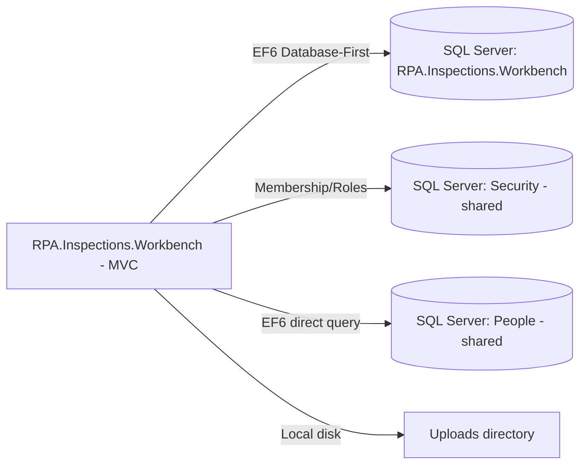

# Assessment - RPA.Inspections.Workbench

## Identification

**Repository Name**: rpa-inspections-workbench (solution: `RPA.Inspections.Workbench`)
**Type**: Web Application (ASP.NET MVC 5, with an Entity Framework "database-first"/EDMX model)
**Language**: C#
**Frameworks**: .NET Framework 4.5.2, ASP.NET MVC 5.2.3, Entity Framework 6.4.4, ASP.NET SQL Membership/Role Provider, EPPlus 4.1.1 (Excel export)
**Repository URL**: Local clone only — `rpa-inspections-workbench/`

## Summary
RPA.Inspections.Workbench is a livestock inspection management portal for what appears to be BCMS (British Cattle Movement Service) — domain entity names include `Cattle`, `Breed`, `Holding`, `LinkedHolding`, `DataRequested`, and `PackRequested`, and there is a dedicated `BcmsAdminController`. The app uses an Entity Framework **Database-First** model (`ERD.edmx`/`ERD.Context.cs`/`ERD.Designer.cs`) rather than Code-First, plus EF Code-First `Migrations` for auxiliary tables — a hybrid EF6 pattern that will need careful handling during an EF Core migration.

Like its siblings, it shares the estate-wide "Security" database for authentication (ASP.NET Membership/Roles + custom `IDT.Web.Security.RoleProvider`) and additionally has its own direct connection to the shared **"People"** SQL Server database (`PeopleContext`), which is the same logical "People" data referenced by `baqu` and, in modernized form, served by the `people-api` service.

## Service Dependencies

### Cloud Services (GCP/AWS/Azure)
- None found — on-prem only

### Databases
- **WorkbenchContext** (`RPA.Inspections.Workbench` on `D3VMPPWSQL003`): primary EF6 Database-First application database (cattle/holding/breed/inspection domain)
- **IDTSecurityConnection** (`Security` DB on `D3VMPRWSQL003`): shared authentication/authorization database
- **PeopleContext** (`People` DB on `D3VMPRWSQL003`, EF Core–style connection string despite this being an EF6 app — likely a legacy naming convention): direct SQL Server access to the same "People" data domain that `people-api` now exposes as a modern HTTP service, and that `baqu` also depends on

### Messaging
- None found

### Storage
- **Local `Uploads/` directory** (folder present in project structure): file uploads are stored on local disk — needs migrating to Azure Blob Storage for any PaaS/container target
- **Local `Images/` directory**: static/generated image assets

### APIs and External Integrations
- None found (no HTTP client dependencies observed) — People data is read directly from the shared SQL Server database, not via `people-api`

### Other Dependencies
- **IDT.Web.Security** (`IDT.dll`, checked-in binary reference under `Assemblies/`) — same shared internal library as `rpa-cph-non-subsidy`, `rpa-mts-inspections`, and `rpa-quality-checks`
- EPPlus — Excel export functionality (consistent with reporting features implied by `PackRequested`/`DataRequested` entities)

## Communication

### Exposed Endpoints
| Method | Path | Description | Authentication |
|--------|------|--------------|-----------------|
| — | `/Admin/*` (`AdminController`) | General application administration | Membership/Roles (estate-standard) |
| — | `/BcmsAdmin/*` (`BcmsAdminController`) | BCMS-specific administration | Membership/Roles |
| — | `/Holding/*` (`HoldingController`) | Holding/farm record management | Membership/Roles |
| — | `/Home/*` (`HomeController`) | Landing pages | Membership/Roles |

### Consumed Endpoints
- None found (People data read directly from SQL Server, not via API)

### Asynchronous Communication
- None found

### Communication Diagram

## Configuration

### Environment Variables
- None — `Web.{Debug,Release,SIT,UAT,Production}.config` transforms

### Configuration Files
- `Web.config` (+ per-environment transforms): connection strings, Membership/Profile/RoleManager config
- `packages.config`: legacy NuGet dependency pinning
- `bundleconfig.json`: ASP.NET bundling/minification config

### Secrets and Sensitive Parameters
- SQL connections use Windows Integrated Security — no stored credentials

## Infrastructure

### Containerization
- **Dockerfile**: No

### Kubernetes/Helm
- **Manifests**: No

### Infrastructure as Code
- **Terraform/Bicep**: No

### CI/CD
- **Pipeline**: None found specific to this app (only the generic scaffolded workflow files injected by the migration tooling)

## Testing

### Coverage
- Not measured

### Test Types
- **Unit**: Yes — `RPA.Inspections.Workbench.Tests` (NUnit3TestAdapter, Moq, EntityFrameworkTesting.Moq)
- **Integration/E2E**: Not evident

### Observations
Test tooling mirrors `bank-holidays` and other siblings (NUnit + Moq + EF6 test helpers).

## Points of Attention for Multi-Cloud/Azure Migration

### Cloud-Specific Dependencies
- None (on-prem), but shares the same "Security" and "People" SQL Server dependencies as the rest of the legacy portal estate

### Hardcoded Configurations
- Hardcoded SQL Server hostnames (`D3VMPPWSQL003`, `D3VMPRWSQL003`) — must be parameterized during migration
- Local file system paths for `Uploads`/`Images` — must move to Blob Storage

### Legacy Code or Old Patterns
- **EF6 Database-First (EDMX)** model — EDMX is not supported by EF Core; this requires either (a) hand-porting the model to EF Core Code-First/Fluent API, or (b) using an EF Core reverse-engineering (scaffolding) pass against the existing database as a starting point. This is meaningfully more migration effort than the Code-First EF6 contexts seen in sibling apps.
- Shared `IDT.Web.Security`/"Security" database dependency — same portfolio-level risk flagged in `rpa-cph-non-subsidy`
- Direct SQL access to the "People" database that `people-api` was built to abstract — a candidate to be **replaced by calling `people-api`** instead of querying the People DB directly, removing one of the shared-database couplings in the estate

### Specific Recommendations
1. Plan the EDMX → EF Core migration explicitly as its own workstream; use `dotnet ef dbcontext scaffold` against a copy of the WorkbenchContext database as a starting point, then reconcile with existing domain classes (`Cattle.cs`, `Breed.cs`, `Holding.cs`, etc. already exist as POCOs outside the EDMX-generated code, per the file listing).
2. Replace direct `PeopleContext` SQL access with calls to `people-api`'s `/getusers/*` endpoints to remove this app from the shared "People" database blast radius.
3. Move `Uploads`/`Images` local file storage to Azure Blob Storage.
4. Coordinate the shared "Security" database / `IDT.dll` migration with the other three dependent apps (see portfolio-level recommendation in the summary report).
5. Confirm whether the BCMS domain overlaps with any external/regulatory system integrations not visible in this codebase (e.g., a national cattle movement service) — the entity names strongly imply an external data feed that was not found as an HTTP/file integration in this pass and should be confirmed with the business owner.

## Additional Observations
- Domain naming (BCMS, Cattle, Holding, Breed) indicates this is a livestock/agriculture inspections system, likely integrating conceptually (if not technically, per this codebase) with a national cattle tracing system — flag for business-context validation in Phase 1 planning.
